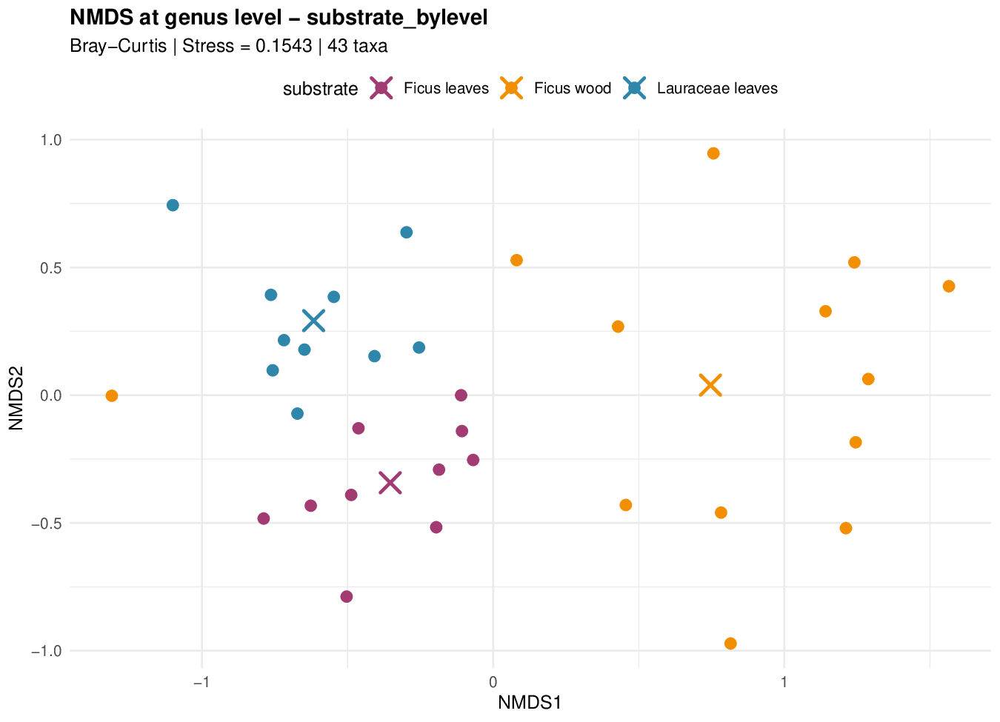
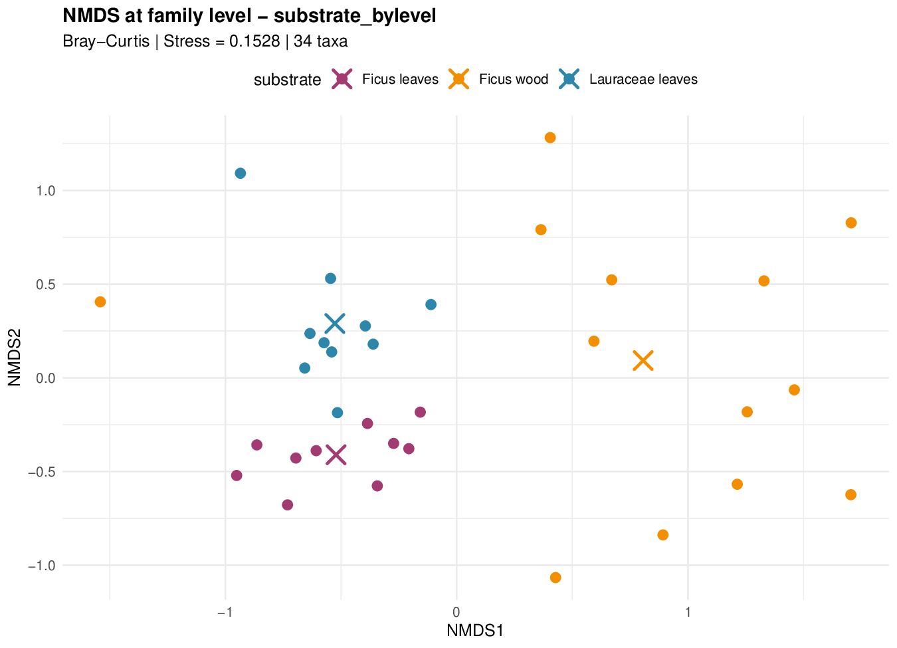

# Fungal Endophyte Community Analysis — LOT2 (Peru)

> **Analysis environment:** R 4.6.1 | Generated on 2026-09-02

## Overview

This project analyses the fungal endophyte communities isolated from three substrates collected in **Peru** (LOT2 sampling campaign):

| Substrate | Isolates (pooled) | Sample-level replicates (units) |
|-----------|:-:|:-:|
| **Ficus leaves** | 264 | 10 |
| **Ficus wood** | 167 | 12 |
| **Lauraceae leaves** | 219 | 8 |

### Sampling design

Samples were collected at different **tree zones** (heights):

- **Zones 1-5**: Tree trunk (zone 1 = lowest, zone 5 = highest)
- **Zone 6**: Canopy branches (highest zone)

Wood collected from zone 6 corresponds to **branch wood** (no trunk present). Wood from zones 1-5 is **trunk wood**.

| Substrate | Zones sampled | Notes |
|-----------|:---:|---|
| Ficus leaves | 6 only | All leaf samples from canopy |
| Ficus wood | 1-6 | Trunk (zones 1-5) and branch (zone 6) |
| Lauraceae leaves | 5-6 | Predominantly zone 6 |

### Handling of uncertain taxonomy (Incertae sedis)

Many isolates cannot be confidently named at every taxonomic rank. Entries flagged `NA`, `"?"`, `"NO"` or `"incertae sedis"` are treated as **Incertae sedis** ("of uncertain placement") and are handled **rank by rank**:

- They are **shown** — as a single pooled *Incertae sedis* category — **only in the abundance bar charts and the pie charts**, so that the full isolate count is never hidden.
- They are **excluded from every diversity index, rank-/relative-abundance curve, Venn diagram and multivariate test**. A single large, shared "unknown" bin behaves like a taxon that is common everywhere: it inflates apparent overlap between substrates and **flattens the real ecological differences** we are trying to detect.
- Because the exclusion is applied **independently at each rank**, an isolate that is unresolved at *species* level but has a defined *genus*, *family* or *order* still contributes to the analyses run at those higher ranks (see **Section D — Multi-level analyses**).

> The sample-level multivariate analyses are run at **ITS-genotype** resolution, where each of the sequenced genotypes is a distinct entity. There is no dominant "unknown" bin at that level, so no isolates are dropped there; the *Incertae sedis* filtering matters only when isolates are grouped into higher taxa.

---

## Input Data

- **`LOT2_pooled_counts.xlsx`** (first sheet) — Pooled genotype counts per substrate with full taxonomy (285 genotypes)
- **`LOT2_samples.xlsx`** (first sheet) — Individual isolate records with sampling zone and unit (650 isolates)

## Scripts

| Script | Purpose |
|--------|---------|
| `main.R` | Master script — loads libraries, sources all other scripts in order |
| `parse_LOT2.R` | Reads both Excel files (first sheet only), standardises column names |
| `plot_abundance.R` | Horizontal bar charts of isolate counts by taxonomic level |
| `plot_abundance_pooled.R` | Bar charts with uncertain taxa pooled as "Incertae sedis" |
| `plot_pie.R` | Pie charts of community composition (3 pies per level) |
| `community_analysis.R` | Full community ecology analyses; ITS-level tests plus multi-rank taxonomic sweeps (Section D) |
| `generate_readme.R` | Generates this README dynamically from analysis results |

```r
# From the project directory:
source("main.R")
```

### R packages used

| Package | Version | Role |
|---------|---------|------|
| readxl | 1.5.0 | Reading Excel input |
| dplyr | 1.2.1 | Data manipulation |
| tidyr | 1.3.2 | Data reshaping |
| ggplot2 | 4.0.3 | Plotting |
| scales | 1.4.0 | Axis formatting |
| vegan | 2.7.5 | Diversity, NMDS, PERMANOVA, ANOSIM, betadisper |
| indicspecies | 1.8.0 | Indicator species analysis (IndVal) |
| ggVennDiagram | 1.5.7 | Venn diagrams |

---

## Output Structure

```
plots/
  abundance/                        # Bar charts (raw)
  abundance_pooled_incertae_sedis/  # Bar charts (uncertain taxa pooled)
  pie_charts/                       # Pie charts
  community/                        # Community ecology plots (NMDS, rarefaction, etc.)
  png/                              # PNG versions for README embedding

tables/                             # Statistical results and summary tables
```

---

# Results

> Throughout the Results, each analysis is introduced with a short **plain-language explanation** of what it measures and how to read it, followed by a **brief interpretation** of what the LOT2 data actually show. A synthesis of all findings is given in the final **Conclusion**.

## A. Alpha Diversity (from pooled counts)

**What it is.** *Alpha diversity* describes how varied the fungal community is **within a single substrate**. It combines two ideas: *richness* (how many different taxa are present) and *evenness* (whether isolates are spread evenly across taxa or dominated by a few). The indices below capture different balances of these two ideas. *Incertae sedis* taxa are excluded so that diversity reflects only confidently identified fungi.

| Index | What it measures | Higher means |
|-------|-----------------|--------------|
| **Richness (S)** | Number of distinct taxa | More taxa present |
| **Shannon (H')** | Combines richness and evenness | More diverse |
| **Simpson (1-D)** | Probability two random individuals differ | More diverse |
| **Inverse Simpson** | Effective number of equally-common species | More even |
| **Pielou (J')** | How evenly individuals are distributed | More even |

### At ITS taxon level

| Substrate | S | N | H' | 1-D | Inv. Simp. | J' |
|-----------|:-:|:-:|:-:|:-:|:-:|:-:|
| Lauraceae leaves | 106 | 219 | 4.2745 | 0.9779 | 45.289 | 0.9166 |
| Ficus leaves | 135 | 264 | 4.4705 | 0.9791 | 47.8681 | 0.9114 |
| Ficus wood | 81 | 167 | 4.0073 | 0.9722 | 35.9858 | 0.9119 |

**Interpretation.** The richest community is **Ficus leaves** (S = 135 distinct ITS taxa), and the least rich is **Ficus wood** (S = 81). Shannon diversity is highest in **Ficus leaves** (H' = 4.4705) and lowest in **Ficus wood** (H' = 4.0073). Pielou evenness is high (J' > 0.9) for all three substrates, meaning no single genotype dominates any community — isolates are spread across many co-occurring taxa. Because richness partly reflects sampling effort (N differs between substrates), richness values should be compared together with the **rarefaction curves** below, which put all substrates on an equal-effort footing.

Diversity was also computed at every higher rank (phylum → genus); the full table is in `tables/alpha_diversity.csv`.


*The bars show Shannon H' for each substrate across taxonomic ranks. H' naturally decreases towards coarser ranks (fewer categories), but the ranking of substrates stays broadly consistent, indicating the diversity differences are not an artefact of one particular rank.*

---

## B. Community Composition

These analyses describe **what the communities are made of** and **how much they overlap**, again after removing *Incertae sedis*.

### B1. Rank-Abundance Curves

**What it is.** Taxa are ranked from most to least abundant (x-axis) against their relative abundance on a log scale (y-axis). A **steep** curve means a few taxa dominate (low evenness); a **shallow, long** curve means many taxa share the community evenly (high evenness). The length of each curve reflects richness.


*Interpretation.* All three substrates show relatively shallow curves with long tails, confirming the high evenness seen in the Pielou index: communities are not dominated by one or two hyper-abundant genera but consist of many moderately frequent taxa plus a long tail of rare ones — a pattern typical of tropical endophyte assemblages.

### B2. Relative Abundance

**What it is.** Stacked bars show the **proportional composition** of each substrate at a given rank (each bar sums to 100%). They make it easy to see which phyla/genera dominate and how composition shifts between substrates.


*Interpretation.* At phylum level the communities are overwhelmingly **Ascomycota**, as expected for culturable endophytes. The genus-level bars reveal the real contrast between substrates: the identity and proportion of dominant genera differ markedly between leaves and wood, foreshadowing the significant substrate effect quantified in the multivariate tests below.

### B3. Venn Diagrams — Shared Taxa

**What it is.** The Venn diagram counts how many taxa are **unique** to each substrate versus **shared** between them. It is a simple presence/absence view of community overlap (abundance is ignored).

*Interpretation.* At **genus level** (43 identified genera in total): **6** genera occur in all three substrates (a shared generalist core), while **2** are unique to Lauraceae leaves, **10** unique to Ficus leaves and **20** unique to Ficus wood. The substantial number of substrate-exclusive genera indicates a degree of **habitat specialisation** layered on top of a shared generalist core.


---

# Multivariate Statistical Analyses

These analyses ask **whether whole communities differ between groups** (substrates, zones, positions). They use the sample-level data (**33 sampling units**, **284 ITS genotypes**), the **Bray-Curtis dissimilarity** (a 0–1 measure of how different two samples are in both *which* taxa are present and *how abundant* they are), and **999 permutations** to obtain p-values without assuming normality.

**How to read each test:**

- **NMDS ordination** — squeezes the many-dimensional Bray-Curtis distances into a 2-D map so that samples plotting close together have similar communities. The **stress** value measures distortion: < 0.10 excellent, < 0.20 acceptable, > 0.20 unreliable. Crosses mark group centroids; shaded ellipses show 95% confidence regions.
- **PERMANOVA** (`adonis2`) — tests whether **group centroids differ**. **R²** is the fraction of community variation explained by the grouping (effect size); a small **p** means the separation is unlikely by chance.
- **ANOSIM** — a complementary rank-based test; **R** ranges from 0 (no separation) to 1 (groups completely distinct).
- **Beta-dispersion / PERMDISP** (`betadisper`) — checks whether groups differ in **within-group spread** rather than location. If PERMDISP is significant, part of a PERMANOVA result may reflect unequal dispersion rather than a pure shift in composition, so it is an important caveat.
- **Pairwise PERMANOVA** — which specific pairs of groups differ, with Holm correction for multiple tests.
- **Rarefaction** — expected richness rescaled to equal sampling effort, so richness can be compared fairly.
- **Indicator species (IndVal)** — identifies taxa statistically associated with (diagnostic of) a particular group.

---

## C1. Substrate Comparison: Ficus Leaves vs Ficus Wood vs Lauraceae Leaves

This is the **headline comparison**: do the three substrates host different fungal communities?

### NMDS Ordination

**Stress = 1e-04** (acceptable to good — the 2-D map is a faithful summary).


*Interpretation.* The three substrates form visually distinct clouds, with the two leaf substrates sitting closer to each other than to wood — consistent with tissue type (leaf vs wood) being a strong driver. The species overlay points to the genotypes pulling each substrate apart.

### PERMANOVA

```
PERMANOVA — Bray-Curtis distance
Formula: community ~ substrate
Permutations: 999

Permutation test for adonis under reduced model
Permutation: free
Number of permutations: 999

adonis2(formula = form, data = meta, permutations = 999, method = "bray")
         Df SumOfSqs      R2      F Pr(>F)    
Model     2    2.728 0.18852 3.4847  0.001 ***
Residual 30   11.742 0.81148                  
Total    32   14.470 1.00000                  
---
Signif. codes:  0 ‘***’ 0.001 ‘**’ 0.01 ‘*’ 0.05 ‘.’ 0.1 ‘ ’ 1
```

**F = 3.4847, R² = 0.18852, p = 0.001** — the substrate effect is **statistically significant**. Substrate explains about **19%** of the total community variation, a large effect for field endophyte data.

### ANOSIM

**R = 0.5283 , p = 0.001 ** — **statistically significant**. An R of this magnitude confirms that between-substrate differences clearly exceed within-substrate variation.

### Beta-dispersion (PERMDISP)

**F = 2.8482, p = 0.083** — dispersion differences are **not statistically significant**. Groups are comparably variable, so the PERMANOVA result reflects a genuine shift in composition rather than unequal spread.

### Pairwise PERMANOVA

Which substrate *pairs* differ (Holm-corrected p). `***` p<0.001, `**` p<0.01, `*` p<0.05.

| Comparison | F | R² | p (raw) | p (Holm) | Sig. |
|-----------|:-:|:-:|:-:|:-:|:-:|
| Ficus leaves vs Ficus wood | 3.8123 | 0.1536 | 0.001 | 0.003 | ** |
| Ficus leaves vs Lauraceae leaves | 3.1421 | 0.1486 | 0.001 | 0.003 | ** |
| Ficus wood vs Lauraceae leaves | 3.4347 | 0.1406 | 0.001 | 0.003 | ** |

*Interpretation.* Every pair of substrates differs significantly after correction — each substrate carries a distinguishable community, not merely one odd substrate against two similar ones.

### Rarefaction

Expected number of taxa if every substrate had been sampled to the same number of isolates — a fair richness comparison that removes the effect of unequal sampling effort.


*Interpretation.* None of the curves has fully levelled off, so additional sampling would still recover new taxa in every substrate (the communities are undersampled, as usual for hyper-diverse tropical fungi). The **relative ordering** of the curves indicates which substrate is richest at equal effort, which is the sampling-fair complement to the raw richness values in Section A.

### Indicator Species (22 significant, p ≤ 0.05)

Indicator (IndVal) analysis finds taxa that are **diagnostic** of a particular substrate — both faithful to it (mostly found there) and frequent within it. **22** ITS genotypes are significant indicators, i.e. reliable biological markers of their substrate. Full ranked list: `tables/indicator_species_significant.csv`.

---

## C2. Ficus Leaves vs Lauraceae Leaves (leaf substrates only)

**Why.** Both are **leaf** endophyte communities but from different host plants, so this isolates the **host effect** from the leaf-vs-wood tissue effect.

**PERMANOVA: F = 3.1421, R² = 0.14862, p = 0.001** — **statistically significant**. Even between two leaf communities, host identity (Ficus vs Lauraceae) leaves a detectable signature, explaining about 15% of the variation.


Full results in `tables/substrate_leaves_*.txt`

---

## D. Multi-level Taxonomic Analyses

**Why this section exists.** The multivariate tests above use **ITS genotypes**, the finest possible resolution. But an isolate that is *Incertae sedis* at species level often still has a defined **genus, family or order**. By linking every isolate to its **full lineage** (from the pooled taxonomy) we can repeat the community comparisons at each rank and ask: **is the substrate/zone signal a fine-scale artefact, or does it hold when isolates are grouped into higher, more confidently identified taxa?**

**Lineage coverage** — isolates with a defined value at each rank (out of 650):

| Rank | Isolates resolved |
|------|:-:|
| phylum | 642 / 650 |
| class | 644 / 650 |
| order | 627 / 650 |
| family | 582 / 650 |
| genus | 537 / 650 |
| species | 238 / 650 |
| its_taxon | 650 / 650 |

### D1. Substrate comparison across ranks

| Rank | Taxa | NMDS stress | PERMANOVA F | R² | p | ANOSIM R | p | PERMDISP p |
|------|:-:|:-:|:-:|:-:|:-:|:-:|:-:|:-:|
| phylum |   4 | 0.0206 |  5.3728 | 0.2637 | 0.004 | 0.2221 | 0.001 | 0.142 |
| class |   9 | 0.1303 | 10.2514 | 0.4060 | 0.001 | 0.3777 | 0.001 | 0.001 |
| order |  25 | 0.1512 | 11.3673 | 0.4311 | 0.001 | 0.5426 | 0.001 | 0.009 |
| family |  34 | 0.1528 | 10.0669 | 0.4016 | 0.001 | 0.5512 | 0.001 | 0.006 |
| genus |  43 | 0.1543 |  9.6143 | 0.3906 | 0.001 | 0.5653 | 0.001 | 0.006 |
| species |  74 | 0.0001 |  4.3616 | 0.2312 | 0.001 | 0.4166 | 0.001 | 0.001 |
| its_taxon | 284 | 0.0001 |  3.4847 | 0.1885 | 0.001 | 0.5283 | 0.001 | 0.083 |

*Interpretation.* The substrate effect is **significant at every taxonomic rank** (PERMANOVA p ≤ 0.004). Crucially, the effect size does **not** weaken when isolates are grouped into higher taxa — it is *strongest* around **order level** (R² ≈ 0.43), compared with R² ≈ 0.19 at ITS level. In other words, the substrates differ not just in which fine genotypes they carry, but in their broad taxonomic make-up, and removing the *Incertae sedis* noise sharpens rather than blurs that separation.





### D2. Ficus wood zones across ranks

| Rank | Taxa | NMDS stress | PERMANOVA F | R² | p | ANOSIM R | p | PERMDISP p |
|------|:-:|:-:|:-:|:-:|:-:|:-:|:-:|:-:|
| phylum |  4 | 0.0326 | 0.4087 | 0.2260 | 0.800 | -0.2550 | 0.840 | 0.404 |
| class |  9 | 0.1354 | 1.2595 | 0.4736 | 0.277 |  0.1771 | 0.217 | 0.362 |
| order | 19 | 0.1114 | 0.9651 | 0.4081 | 0.474 |  0.0371 | 0.400 | 0.180 |
| family | 26 | 0.1242 | 0.9202 | 0.3966 | 0.613 | -0.0471 | 0.549 | 0.004 |
| genus | 29 | 0.1238 | 0.8693 | 0.3831 | 0.753 | -0.1200 | 0.696 | 0.001 |
| species | 29 | 0.0001 | 0.9833 | 0.4126 | 0.549 | -0.0621 | 0.628 | 0.001 |
| its_taxon | 82 | 0.0001 | 0.9147 | 0.3952 | 0.775 | -0.1893 | 0.793 | 0.001 |

*Interpretation.* At **no** taxonomic rank do Ficus-wood communities differ significantly among tree zones (all PERMANOVA p > 0.05). The vertical position of wood on the tree does **not** structure its fungal community detectably — the same conclusion reached at ITS level, now confirmed to be robust to taxonomic resolution.

### D3. Substrate × position across ranks

| Rank | Taxa | NMDS stress | PERMANOVA F | R² | p | ANOSIM R | p | PERMDISP p |
|------|:-:|:-:|:-:|:-:|:-:|:-:|:-:|:-:|
| phylum |   4 | 0.0206 | 3.4825 | 0.3322 | 0.006 | 0.3129 | 0.001 | 0.130 |
| class |   9 | 0.1303 | 8.5185 | 0.5489 | 0.001 | 0.5309 | 0.001 | 0.105 |
| order |  25 | 0.1512 | 8.1406 | 0.5377 | 0.001 | 0.6307 | 0.001 | 0.186 |
| family |  34 | 0.1528 | 7.3230 | 0.5113 | 0.001 | 0.6382 | 0.001 | 0.081 |
| genus |  43 | 0.1543 | 6.7447 | 0.4907 | 0.001 | 0.6396 | 0.001 | 0.042 |
| species |  74 | 0.0001 | 3.2213 | 0.3231 | 0.001 | 0.5661 | 0.001 | 0.092 |
| its_taxon | 284 | 0.0001 | 2.5596 | 0.2678 | 0.001 | 0.6036 | 0.001 | 0.133 |

*Interpretation.* Combining substrate with trunk/branch position remains significant at every rank, and the effect size again peaks at intermediate ranks (class–family). This mirrors the substrate result: the signal is carried by broad taxonomic groups, not just rare fine-scale genotypes.

Summary tables: `tables/substrate_multilevel_summary.csv`, `tables/ficus_wood_zones_multilevel_summary.csv`, `tables/substrate_x_position_multilevel_summary.csv`.

---

## E. Zone-Based Analyses

These test whether **height on the tree** (trunk zones 1–5 vs canopy branch zone 6) structures the community. All are run at ITS-genotype level; Section D2 already showed the zone question is also answered the same way at higher ranks.

### E1. Ficus Wood Across Zones

Community comparison of Ficus wood isolates collected at different tree zones (1–6).


*Interpretation.* Samples from different zones intermingle on the NMDS with no zone-wise grouping, indicating wood-inhabiting fungi are distributed largely independently of height. Full results: `tables/ficus_wood_zones_*.txt`.

### E2. Ficus Wood: Trunk (Zones 1-5) vs Branch (Zone 6)

**PERMANOVA: F = 1.9802, R² = 0.15256, p = 0.004** — **statistically significant**. Trunk and branch wood host detectably different communities.


### E4. Substrate Comparison at Zone 6 (Branch Level Only)

**Why.** Restricting to zone 6 removes any confound between substrate and height, since all three substrates are present there.

**PERMANOVA: F = 2.7801, R² = 0.20175, p = 0.001** — **statistically significant**. The substrate effect persists even within a single zone, confirming it is driven by substrate itself and not by differences in sampling height.


### E5. Substrate × Position Interaction

Combined-factor analysis testing whether communities differ across substrate-position combinations (e.g. *Ficus wood - Trunk* vs *Ficus wood - Branch* vs *Ficus leaves - Branch* ...).


*Interpretation.* Groups separate primarily **by substrate**, with position adding only minor structure — substrate is the dominant organiser of these endophyte communities (see also the multi-rank confirmation in Section D3).

---

## Abundance & Composition Plots (Incertae sedis retained)

Unlike every analysis above, the plots below **keep the *Incertae sedis* isolates** (as an explicit pooled category), so they present the complete isolate census without hiding unidentified material.

### `plots/abundance_pooled_incertae_sedis/`

Horizontal grouped bar charts of **absolute isolate counts** per taxon, split by substrate, with unresolved taxa collected into an *Incertae sedis* bar.


### `plots/pie_charts/`

Proportional composition of each substrate; the *Incertae sedis* slice shows how much of each community remains unidentified at that rank.


---

# Conclusion

1. **Substrate is the primary driver of community structure.** The three substrates host significantly different fungal communities (PERMANOVA p = 0.001, R² ≈ 0.19), and this holds at **every taxonomic rank** — the effect is in fact strongest around **order level** (R² ≈ 0.43). The two leaf substrates are more similar to each other than to wood, i.e. **tissue type (leaf vs wood)** is the strongest split, with **host identity (Ficus vs Lauraceae leaves)** adding a secondary but significant effect (p = 0.001).
2. **Tree height has at most a weak effect.** Treated as six discrete zones, height does **not** structure Ficus-wood communities at any taxonomic rank (Section D2, all p > 0.05). When the wood is instead split simply into **trunk vs branch**, a modest but **statistically significant** difference emerges (p = 0.004, R² ≈ 0.15): branch wood carries a somewhat distinct community from trunk wood, but this coarse contrast explains far less variation than substrate does.
3. **The substrate signal is real, not a sampling-height artefact.** Even when the comparison is restricted to zone 6 alone (where all substrates co-occur), substrates remain **statistically significant** (p = 0.001).
4. **Communities are diverse and even.** All substrates show high evenness (Pielou J' > 0.9) and long rank-abundance tails; rarefaction curves have not saturated, so true richness is higher still. A shared generalist core of genera co-exists with a substantial set of substrate-exclusive taxa.
5. **Removing *Incertae sedis* sharpened the picture.** Excluding the pooled "unknown" bin from the diversity, overlap and multivariate analyses (while keeping it visible in the abundance/pie plots) increased, rather than decreased, the measured separation between substrates — confirming that the unidentified fraction had been masking genuine differences.

---

*Auto-generated on 2026-09-02 by `generate_readme.R`*
