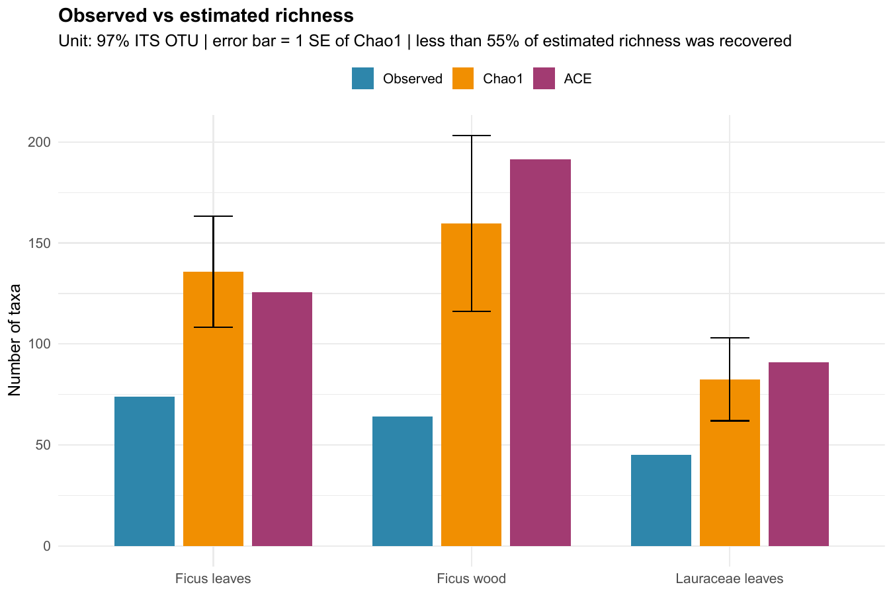
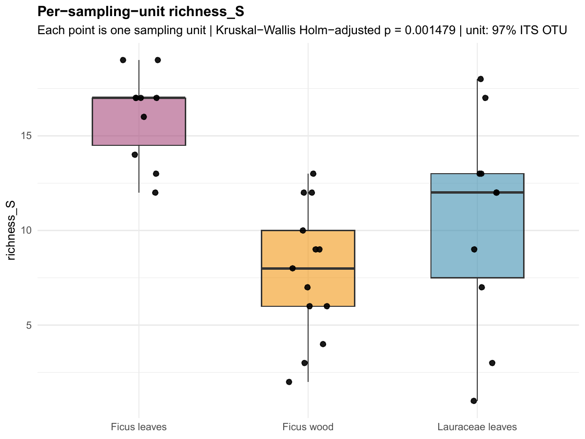
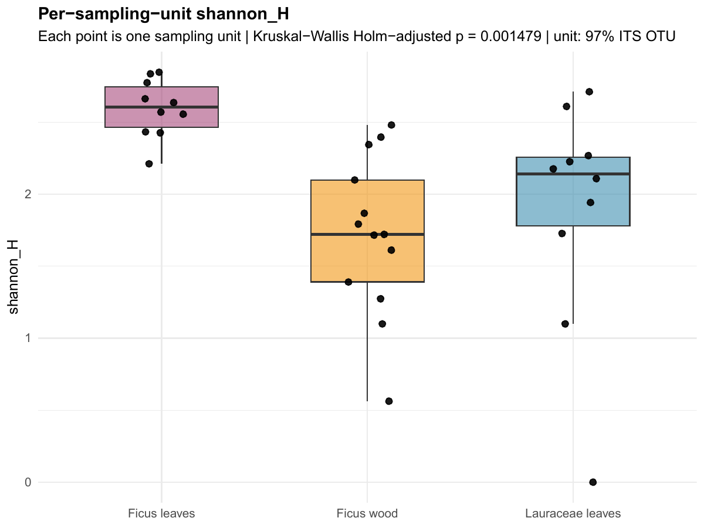
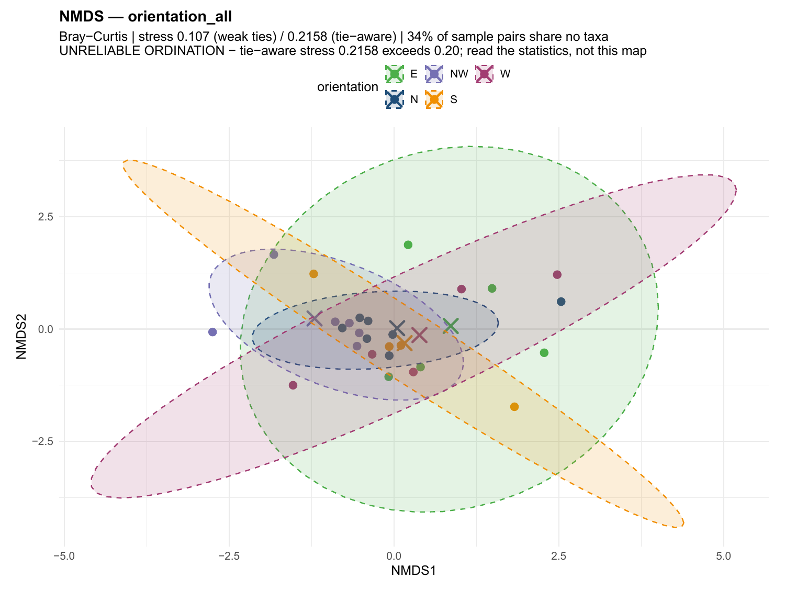
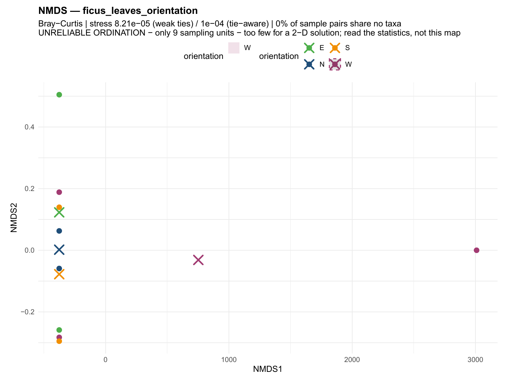
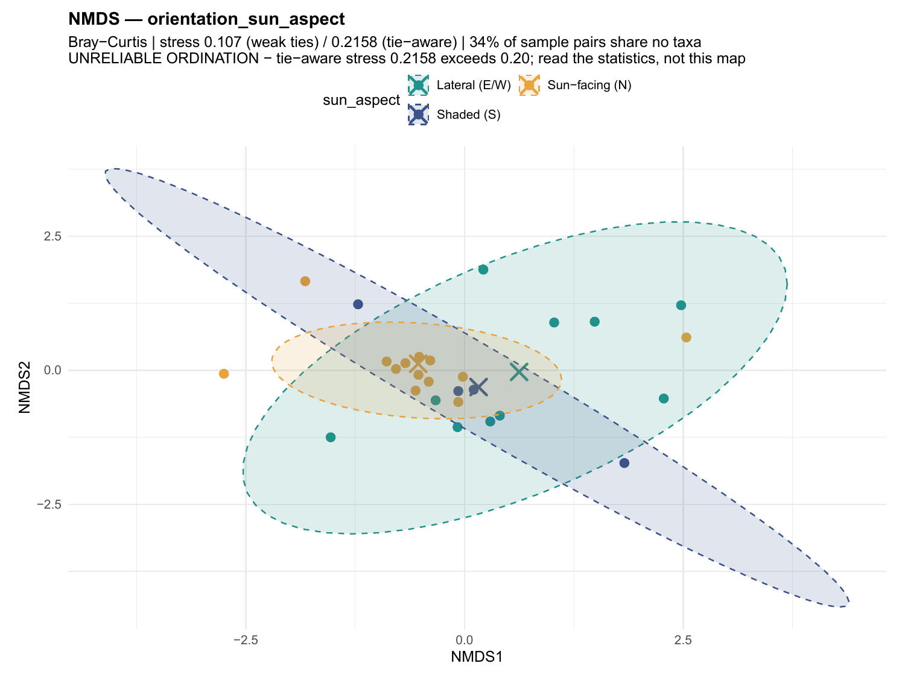
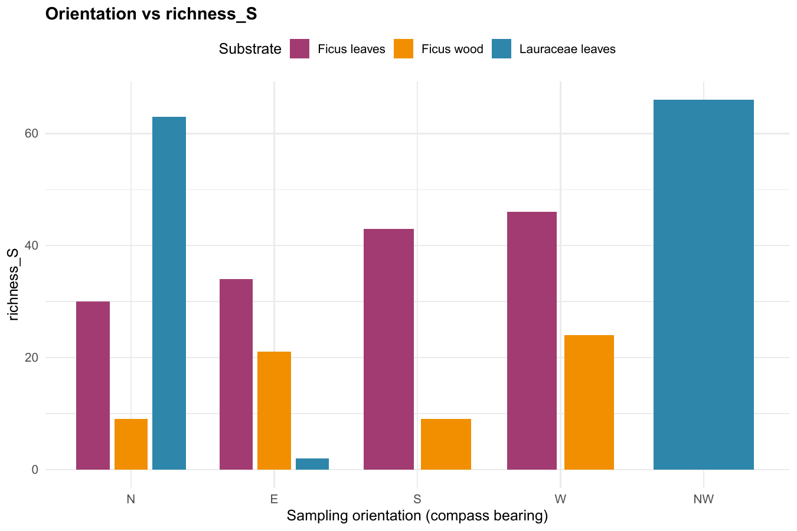
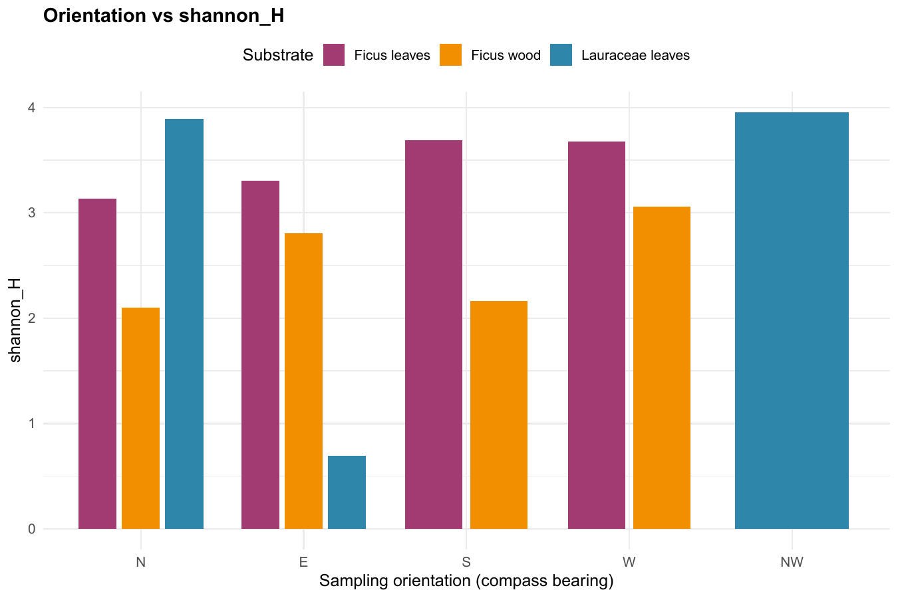
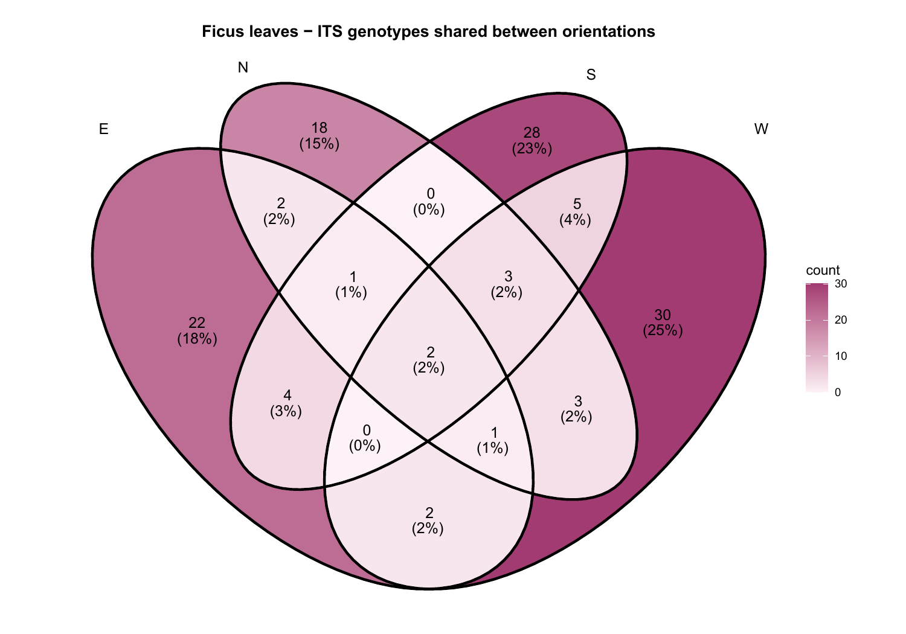
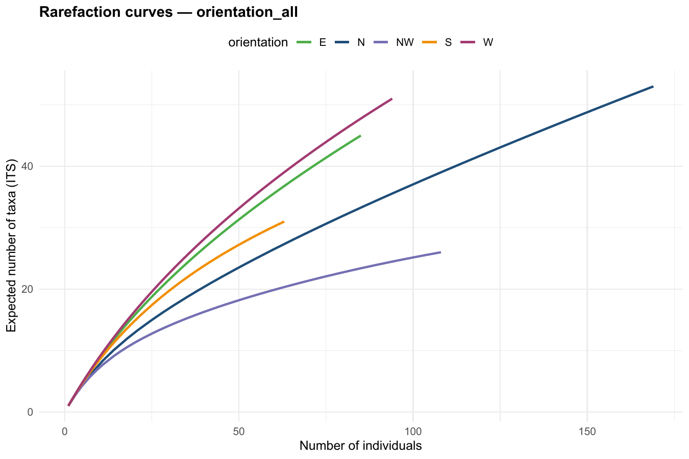

# Fungal Endophyte Community Analysis — LOT2 (Peru)

> **Analysis environment:** R 4.5.2 | Generated on 2026-09-22

## Overview

This project analyses the fungal endophyte communities isolated from three substrates collected in **Peru** (LOT2 sampling campaign):

| Substrate | Isolates (pooled) | Sample-level replicates (units) |
|--------------------|:-----------------:|:------------------------:|
| **Ficus leaves** | 264 | 10 |
| **Ficus wood** | 167 | 13 |
| **Lauraceae leaves** | 219 | 10 |

### Sampling design: what was sampled, and the assumptions behind it

> **This section records assumptions supplied by the data owner, not facts derivable from the files.** They are written out so collaborators can check the reasoning, and because several of them change how the results must be read. If any is wrong, the analyses affected are named underneath it.

**1. Two individual trees were sampled — one of each host.** A strangler *Ficus* growing on a single Lauraceae host tree. There is no tree-level replication, and no tree identifier in the raw files; `parse_LOT2.R` assigns `tree_id` from the substrate.

*Consequence.* The **inferential unit is the individual tree, not the host species.** *Ficus* leaves vs *Ficus* wood is a genuine within-tree tissue contrast. But *Ficus* vs Lauraceae compares **one tree with one other tree**, so every "host effect" below describes these two individuals. Sampling units are treated as replicates by PERMANOVA, which is pseudoreplication at the species level: the p-values are real for the trees sampled and cannot be generalised to *Ficus* vs Lauraceae as taxa. All host-level statements are phrased accordingly.

**2. The two trees are not independent.** The *Ficus* is a strangler growing **on** the Lauraceae, so the two root systems, canopies and microclimates are physically interlocked and share a continuous surface for fungal dispersal.

*Consequence.* Any host difference is a difference between two *interlocked* individuals, which is a conservative setting for detecting host effects (shared exposure should erode differences, not create them) but rules out treating them as independent samples of two species.

**3. The Lauraceae trunk was never sampled — it was inaccessible, completely encased by the strangling Ficus.** All Lauraceae material came from exposed upper branches.

*Consequence.* This one **changes the data.** The rule "zone ≤ 5 = trunk" is correct for the *Ficus* but wrong for the Lauraceae: applied blindly it mislabelled **3 sampling units / 53 isolates** (the zone-5 Lauraceae units) as trunk material. `parse_LOT2.R` now assigns `position = "Branch"` to all Lauraceae. The previous `lauraceae_leaves_trunk_vs_branch_*` analysis was therefore comparing branch against branch and has been removed. Note also that **zone means different things on the two trees**: on the *Ficus* it is height on a continuous trunk; on the Lauraceae it distinguishes two bands of exposed canopy branch.

**4. Whether the Lauraceae material is leaves or branch wood is still unconfirmed.** `LOT2_pooled_counts.xlsx` labels the column "Lauraceae leaves"; the samples workbook has a sheet titled "66. Fungi-Endo wood (Host)". The data owner indicates the material came from branches, without settling leaf vs wood. The analyses retain the label **Lauraceae leaves**.

*Consequence.* **The one conclusion that depends on this is the tissue-type claim.** If the Lauraceae material is leaves, the finding "the two leaf substrates resemble each other more than either resembles wood" stands and tissue type is the dominant split. If it is branch wood, that grouping is wrong and the pattern would have to be re-read as *Ficus* vs Lauraceae. Everything else — diversity, orientation, zone — is unaffected. **This should be resolved before the tissue-type interpretation is published.**

**5. Each row is an independent colony; no de-replication is required.** Repeated isolates of the same genotype within a sampling unit could be either independent colonisations or one colony subsampled. The rule given is that a **shared `Hofstetter-culture code` marks subsamples of a single colony**. The parser checks this: all **650 isolates carry 650 distinct culture codes**, so no collapsing is needed and abundances are counts of independent colonies.

*Consequence.* None — but the check now runs on every pipeline execution and will warn if a future data version reuses a code.

**6. Only the first sheet of each workbook is authoritative.** The remaining sheets (per-substrate extracts of 264 / 167 / 20 isolates, and the sequence sheet) are working material. The pipeline reads sheet 1 for both files, plus the sequence sheet `Feuil2` for OTU clustering.

### Sampling design

Samples were collected at different **tree zones** (heights), zone 1 lowest to zone 6 highest. On the *Ficus*, zones 1-5 are trunk and zone 6 is canopy branch. On the Lauraceae the trunk was inaccessible (assumption 3 above), so its zones 5 and 6 are both **exposed upper branch**, not trunk.

| Substrate | Tree | Zones | Position | Sampling units |
|----------------|-----------------|:-----:|------------------------|:--------------:|
| Ficus leaves | Ficus (strangler) | 6 | Canopy branch | 10 |
| Ficus wood | Ficus (strangler) | 1-6 | Trunk (1-5) + branch (6) | 13 |
| Lauraceae leaves | Lauraceae (host) | 5-6 | Exposed branch only | 10 |

Because the Lauraceae contributes no trunk material, every trunk-vs-branch contrast in this report is a **Ficus** contrast.

#### Sampling orientation

Each sampled branch (and, where recorded, trunk face) also carries a **compass orientation**. This information only became usable once the field team reconciled two independent labelling systems: the colour codes written down by the climbers in the field, and the branch numbering entered into the project database. The two disagreed (notably a blue/turquoise colour clash, where blue should have been reserved for the Lauraceae, and disputed collection zones for the Lauraceae branches), so earlier versions of `LOT2_samples.xlsx` had an empty orientation column.

The re-issued workbook settles that correspondence and adds it as a reconciled column, which the analyses in **Section F** use. Two clean-up rules are applied when reading it:

- Some bearings still carry a replicate index (`N1`-`N4`, `NW1`-`NW4`). The digit identifies **which branch**, not which direction, so it is stripped: `N3` becomes `N`.
- Material marked `?`, and all Ficus trunk wood (for which no orientation was ever recorded), is treated as **unresolved** and excluded from the orientation analyses.

This leaves **519 of 650 isolates** (80%) with a usable bearing; **131** are unresolved. A single sampling unit can span more than one bearing, so the orientation analyses group isolates by **substrate x zone x unit x bearing**, giving **27 orientation-level sampling units** rather than the 33 used elsewhere.

### Handling of uncertain taxonomy (Incertae sedis)

Many isolates cannot be confidently named at every taxonomic rank. Entries flagged `NA`, `"?"`, `"NO"` or `"incertae sedis"` are treated as **Incertae sedis** ("of uncertain placement") and are handled **rank by rank**:

- They are **shown** — as a single pooled *Incertae sedis* category — **only in the abundance bar charts and the pie charts**, so that the full isolate count is never hidden.
- They are **excluded from every diversity index, rank-/relative-abundance curve, Venn diagram and multivariate test**. A single large, shared "unknown" bin behaves like a taxon that is common everywhere: it inflates apparent overlap between substrates and **flattens the real ecological differences** we are trying to detect.
- Because the exclusion is applied **independently at each rank**, an isolate that is unresolved at *species* level but has a defined *genus*, *family* or *order* still contributes to the analyses run at those higher ranks (see **Section D — Multi-level analyses**).

> The sample-level multivariate analyses are run at **ITS-genotype** resolution, where each of the sequenced genotypes is a distinct entity. There is no dominant "unknown" bin at that level, so no isolates are dropped there; the *Incertae sedis* filtering matters only when isolates are grouped into higher taxa.

---

## Input Data

- **`LOT2_pooled_counts.xlsx`** (first sheet) — Pooled genotype counts per substrate with full taxonomy (284 genotypes)
- **`LOT2_samples.xlsx`** (first sheet) — Individual isolate records with sampling zone, unit and reconciled branch/trunk orientation (650 isolates)

  The workbook also keeps the reconciliation working columns (field colour code, database colour code, pre-reconciliation orientation, field notes). They are read for traceability but only the reconciled orientation column is used. Sheet `Feuil2` holds one ITS sequence per isolate and is used for OTU clustering. Remaining sheets are working material and are not read.

- **`LOT2_otu_map.csv`** — isolate → OTU assignment produced by `cluster_otus.sh` (142 OTUs at 97% ITS identity). Committed so the pipeline runs without vsearch.

### The analytical unit

Community analyses use **97% ITS OTUs**, not the BLAST-derived name strings. Those names are not a clustered unit: they over-split (near-identical sequences filed under two spellings, e.g. *guandongensis* / *guangdongensis*) and over-lump (single labels covering "26 spp."). Clustering the 650 ITS sequences themselves collapses 284 name labels into **142 OTUs**, and materially improves the data:

| | Name labels | 97% OTUs |
|------------------------|:-----------:|:--------------:|
| Taxa | 284 | 142 |
| Good's coverage | 70% | **74.9-88.6%** |
| Sample pairs sharing no taxon | 59% | **42%** |

`cluster_otus.sh` regenerates the mapping (needs `vsearch`); it is deterministic and only needs re-running if the sequences change.

### Input integrity checks

`parse_LOT2.R` now refuses to analyse silently-inconsistent inputs. It drops spreadsheet **totals rows** (rows with neither a culture code nor a taxon name — one such row was previously read as a genotype and plotted as a giant *Incertae sedis* category), verifies that pooled and sample-level isolate totals agree, and checks that culture codes are unique, since a repeated code would mark subsamples of one colony that must be collapsed before abundances mean anything.

## Scripts

| Script | Purpose |
|------------------------|------------------------|
| `main.R` | Master script — loads libraries, sources all other scripts in order |
| `cluster_otus.sh` | Clusters the ITS sequences into OTUs (run once; needs `vsearch`) |
| `parse_LOT2.R` | Reads both workbooks, joins the OTU map, applies design rules, runs integrity checks |
| `plot_abundance.R` | Horizontal bar charts of isolate counts by taxonomic level |
| `plot_abundance_pooled.R` | Bar charts with uncertain taxa pooled as "Incertae sedis" |
| `plot_pie.R` | Pie charts of community composition (3 pies per level) |
| `community_analysis.R` | Multivariate community ecology; OTU-level tests plus multi-rank taxonomic sweeps (Section D) |
| `diversity_analysis.R` | Sampling completeness (Chao1/ACE/coverage) and replicated per-unit alpha diversity |
| `generate_readme.R` | Generates this README dynamically from analysis results |

```r
# From the project directory:
source("main.R")
```

### R packages used

| Package | Version | Role |
|-------------|-------|------------------------|
| readxl | 1.4.5 | Reading Excel input |
| dplyr | 1.1.4 | Data manipulation |
| tidyr | 1.3.1 | Data reshaping |
| ggplot2 | 4.0.1 | Plotting |
| scales | 1.4.0 | Axis formatting |
| vegan | 2.7.6 | Diversity, NMDS, PERMANOVA, ANOSIM, betadisper |
| indicspecies | 1.8.0 | Indicator species analysis (IndVal) |
| ggVennDiagram | 1.5.7 | Venn diagrams |

---

## Output Structure

```
plots/
  abundance/                        # Bar charts (raw)
  abundance_pooled_incertae_sedis/  # Bar charts (uncertain taxa pooled)
  pie_charts/                       # Pie charts
  community/                        # Community ecology plots (NMDS, rarefaction, etc.)
  png/                              # PNG versions for README embedding

tables/                             # Statistical results and summary tables
```

---

# Results

> Throughout the Results, each analysis is introduced with a short **plain-language explanation** of what it measures and how to read it, followed by a **brief interpretation** of what the LOT2 data actually show. A synthesis of all findings is given in the final **Conclusion**.

## A0. How much of the community was actually found?

**Why this comes first.** Every diversity number below is a *sample* statistic. Culture-based sampling of tropical endophytes recovers a fraction of what is present, and how large that fraction is determines what the rest of the section can claim. Two standard measures answer it: **Chao1/ACE** estimate the true richness from how many taxa were seen once or twice, and **Good's coverage** estimates the probability that the *next* isolate collected would belong to a taxon already seen.

| Substrate | Units | Isolates | Observed | Chao1 (±SE) | ACE | % of Chao1 | Singletons | Coverage |
|----------------|:-----:|:--------:|:--------:|:------------:|:-----:|:----------:|:----------:|:--------:|
| Ficus leaves | 10 | 264 | 74 | 135.8 ± 27.5 | 125.6 | **55%** | 39 | 85.2% |
| Ficus wood | 13 | 167 | 64 | 159.7 ± 43.5 | 191.3 | **40%** | 42 | 74.9% |
| Lauraceae leaves | 10 | 219 | 45 |  82.5 ± 20.6 |  90.9 | **55%** | 25 | 88.6% |

*Interpretation.* Only **40-55% of the estimated richness was recovered**, with Good's coverage of 74.9-88.6%. Roughly one isolate in seven belongs to an OTU seen exactly once. Two things follow. First, **all observed richness values are substantial underestimates** and should be quoted alongside Chao1. Second, *Ficus* wood is the least completely sampled substrate (40% of Chao1), so its apparently lower richness is partly a sampling artefact — which is why the comparison below is done per sampling unit and again at equal coverage.



#### Richness compared at equal coverage

Comparing richness at equal *isolate count* still favours whichever substrate has the flatter abundance distribution. The fairer contrast standardises to equal **coverage** (Chao & Jost 2012) — how many taxa each substrate holds at the same level of sampling completeness.

| Substrate | Isolates needed | Coverage reached | Richness at that coverage |
|----------------|:---------------:|:----------------:|:------------------------:|
| Ficus leaves | 108 | 74.6% | **44.6** |
| Ficus wood | 155 | 74.2% | **60.9** |
| Lauraceae leaves |  37 | 75.7% | **16.1** |

*Interpretation — and an apparent contradiction worth understanding.* At equal coverage the ranking **reverses**: *Ficus* **wood** is the richest substrate, not the poorest. The two statements are not in conflict because they answer different questions. Per sampling unit (A1 below), a patch of wood carries **fewer** taxa than a patch of leaf — lower alpha diversity. But wood needs far more isolates to reach the same coverage, because its community has a much longer tail of rare taxa; pooled across the substrate it therefore holds **more** taxa overall. In short: **leaf units are individually richer, while the wood community as a whole is more diverse and more heterogeneous between units.** That heterogeneity is the same pattern the dispersion test picks up (Section D), and it is a substantive ecological result rather than an artefact.

Full tables: `tables/sampling_completeness.csv`, `tables/richness_at_equal_coverage.csv`.

---

## A. Alpha Diversity

**What it is.** *Alpha diversity* describes how varied the fungal community is **within a single substrate**. It combines *richness* (how many taxa) with *evenness* (whether isolates are spread across taxa or dominated by a few).

| Index | What it measures | Higher means |
|----------------------|------------------------|-----------------|
| **Richness (S)** | Number of distinct taxa | More taxa present |
| **Shannon (H')** | Combines richness and evenness | More diverse |
| **Hill q1** (= exp H') | Effective number of common taxa | More diverse |
| **Simpson (1-D)** | Probability two random individuals differ | More diverse |
| **Pielou (J')** | How evenly individuals are distributed | More even |

### A1. Per sampling unit — the version that can be tested

Diversity is computed **per sampling unit**, giving 10 / 13 / 10 independent values per substrate instead of one pooled number. That is what makes a significance test possible at all: a single pooled value per substrate has no variance and supports no inference.

| Substrate | Units | Isolates | Mean S (±SD) | Mean H' (±SD) | Mean Hill q1 | Mean J' |
|----------------|:-----:|:--------:|:------------:|:-------------:|:------------:|:-------:|
| Ficus leaves | 10 | 264 | 16.10 ± 2.38 | 2.595 ± 0.201 | 13.63 | 0.936 |
| Ficus wood | 13 | 167 |  7.77 ± 3.52 | 1.719 ± 0.551 |  6.34 | 0.892 |
| Lauraceae leaves | 10 | 219 | 10.50 ± 5.54 | 1.886 ± 0.803 |  8.12 | 0.900 |

Kruskal-Wallis across substrates (Holm-adjusted across the four indices):

| Index | H | df | p | p (Holm) |
|----------|:-------:|:---:|:---------:|:------------:|
| richness_S | 15.8051 | 2 | 0.0003698 | **0.001479** |
| shannon_H | 15.2565 | 2 | 0.0004865 | **0.001479** |
| hill_q1 | 15.2565 | 2 | 0.0004865 | **0.001479** |
| pielou_J |  2.6512 | 2 | 0.2656000 | **0.265600** |

Pairwise follow-ups (Wilcoxon, Holm-adjusted):

| Index | Comparison | p (Holm) |
|----------|------------------------|:---------:|
| richness_S | Ficus wood vs Ficus leaves | 0.0003370 |
| richness_S | Lauraceae leaves vs Ficus leaves | 0.0321200 |
| richness_S | Lauraceae leaves vs Ficus wood | 0.1607000 |
| shannon_H | Ficus wood vs Ficus leaves | 0.0006727 |
| shannon_H | Lauraceae leaves vs Ficus leaves | 0.0145700 |
| shannon_H | Lauraceae leaves vs Ficus wood | 0.2642000 |

*Interpretation.* **Richness and Shannon differ significantly between substrates** (Holm-adjusted p = 0.001479 and 0.001479), driven by *Ficus* leaves being richer and more diverse than *Ficus* wood; the Lauraceae sits between them and is not separable from wood. **Evenness (Pielou J') does not differ** (p = 0.2656): all three communities are similarly un-dominated, and the difference is in how many taxa are present, not how they are balanced. Because *Ficus* wood is also the least completely sampled substrate, part of its lower richness is sampling effort — the effect is real but its size should not be read off these means alone.





Per-unit values: `tables/alpha_diversity_per_unit.csv`; tests: `tables/alpha_diversity_tests.csv`, `tables/alpha_diversity_pairwise.csv`.

### A2. Pooled indices across taxonomic ranks

The table below is the pooled view (one value per substrate per rank) retained for comparability with earlier versions of this report. **It carries no error and supports no test** — use A1 for inference. *Incertae sedis* taxa are excluded rank by rank.

### At ITS taxon level

| Substrate | S | N | H' | 1-D | Inv. Simp. | J' |
|----------------|:---:|:---:|:------:|:------:|:----------:|:------:|
| Lauraceae leaves | 106 | 219 | 4.2745 | 0.9779 | 45.289 | 0.9166 |
| Ficus leaves | 135 | 264 | 4.4705 | 0.9791 | 47.8681 | 0.9114 |
| Ficus wood | 81 | 167 | 4.0073 | 0.9722 | 35.9858 | 0.9119 |

**Interpretation.** The richest community is **Ficus leaves** (S = 135 distinct ITS taxa), and the least rich is **Ficus wood** (S = 81). Shannon diversity is highest in **Ficus leaves** (H' = 4.4705) and lowest in **Ficus wood** (H' = 4.0073). Pielou evenness is high (J' > 0.9) for all three substrates, meaning no single genotype dominates any community — isolates are spread across many co-occurring taxa. Because richness partly reflects sampling effort (N differs between substrates), richness values should be compared together with the **rarefaction curves** below, which put all substrates on an equal-effort footing.

Diversity was also computed at every higher rank (phylum → genus); the full table is in `tables/alpha_diversity.csv`.


*The bars show Shannon H' for each substrate across taxonomic ranks. H' naturally decreases towards coarser ranks (fewer categories), but the ranking of substrates stays broadly consistent, indicating the diversity differences are not an artefact of one particular rank.*

---

## B. Community Composition

These analyses describe **what the communities are made of** and **how much they overlap**, again after removing *Incertae sedis*.

### B1. Rank-Abundance Curves

**What it is.** Taxa are ranked from most to least abundant (x-axis) against their relative abundance on a log scale (y-axis). A **steep** curve means a few taxa dominate (low evenness); a **shallow, long** curve means many taxa share the community evenly (high evenness). The length of each curve reflects richness.


*Interpretation.* All three substrates show relatively shallow curves with long tails, confirming the high evenness seen in the Pielou index: communities are not dominated by one or two hyper-abundant genera but consist of many moderately frequent taxa plus a long tail of rare ones — a pattern typical of tropical endophyte assemblages.

### B2. Relative Abundance

**What it is.** Stacked bars show the **proportional composition** of each substrate at a given rank (each bar sums to 100%). They make it easy to see which phyla/genera dominate and how composition shifts between substrates.


*Interpretation.* At phylum level the communities are overwhelmingly **Ascomycota**, as expected for culturable endophytes. The genus-level bars reveal the real contrast between substrates: the identity and proportion of dominant genera differ markedly between leaves and wood, foreshadowing the significant substrate effect quantified in the multivariate tests below.

### B3. Venn Diagrams — Shared Taxa

**What it is.** The Venn diagram counts how many taxa are **unique** to each substrate versus **shared** between them. It is a simple presence/absence view of community overlap (abundance is ignored).

*Interpretation.* At **genus level** (43 identified genera in total): **6** genera occur in all three substrates (a shared generalist core), while **2** are unique to Lauraceae leaves, **10** unique to Ficus leaves and **20** unique to Ficus wood. The substantial number of substrate-exclusive genera indicates a degree of **habitat specialisation** layered on top of a shared generalist core.


---

# Multivariate Statistical Analyses

These analyses ask **whether whole communities differ between groups** (substrates, zones, positions). They use the sample-level data (**33 sampling units**, **142 ITS genotypes**), the **Bray-Curtis dissimilarity** (a 0–1 measure of how different two samples are in both *which* taxa are present and *how abundant* they are), and **999 permutations** to obtain p-values without assuming normality.

**How to read each test:**

- **NMDS ordination** — squeezes the many-dimensional Bray-Curtis distances into a 2-D map so that samples plotting close together have similar communities. The **stress** value measures distortion: < 0.10 excellent, < 0.20 acceptable, > 0.20 unreliable. Crosses mark group centroids; shaded ellipses show 95% confidence regions. **A stress at or near zero is a warning, not a triumph** — see the caveat below, which explains why these plots report two stress values.
- **PERMANOVA** (`adonis2`) — tests whether **group centroids differ**. **R²** is the fraction of community variation explained by the grouping (effect size); a small **p** means the separation is unlikely by chance.
- **ANOSIM** — a complementary rank-based test; **R** ranges from 0 (no separation) to 1 (groups completely distinct).
- **Beta-dispersion / PERMDISP** (`betadisper`) — checks whether groups differ in **within-group spread** rather than location. If PERMDISP is significant, part of a PERMANOVA result may reflect unequal dispersion rather than a pure shift in composition, so it is an important caveat.
- **Pairwise PERMANOVA** — which specific pairs of groups differ, with Holm correction for multiple tests.
- **Rarefaction** — expected richness rescaled to equal sampling effort, so richness can be compared fairly.
- **Indicator species (IndVal)** — identifies taxa statistically associated with (diagnostic of) a particular group. One test is run **per taxon**, so the raw p-values are corrected with Benjamini-Hochberg and only taxa passing **FDR q ≤ 0.05** are reported as indicators. Without that correction, ~14 of ~280 taxa pass p ≤ 0.05 by chance alone.

### An important caveat: why the ITS-level ordinations collapse onto a line

Several NMDS plots in this report show most samples squeezed onto a single near-vertical line with one point flung far away, next to a stress of ~0.0001. That is **not** an excellent fit and **not** a plotting bug — it is a known failure mode of NMDS, and it is worth understanding because it determines which figures can be read.

**The cause.** At ITS-genotype resolution this dataset is dominated by rare taxa: **52% of the 142 genotypes were isolated exactly once**, so **42% of all sampling-unit pairs share no genotype whatsoever**. Every one of those pairs has a Bray-Curtis dissimilarity of *exactly* 1 — they are **tied**.

NMDS fits an ordination by rank order, and by default (`monoMDS`, weak/primary ties) **tied dissimilarities are allowed to map to any distances at all**. With well over half of the pairs tied, the optimiser is therefore free to ignore most of the matrix: it only has to get the *ordering* of the minority of pairs that do share taxa right. It can do that almost perfectly in two dimensions — hence the near-zero stress — while pushing the unconstrained samples wherever is convenient. The collapsed line and the distant outlier are those unconstrained samples.

**The evidence.** Refitting the same dissimilarities with *strong* (secondary) ties, which force tied pairs to equal distances, gives the honest answer. At ITS level the stress jumps from **0.0001 to 0.249** — i.e. *unreliable* by the usual thresholds. At genus level the two figures agree closely (0.1555 vs 0.1637), confirming that those ordinations are real. Every NMDS plot in this report now prints **both** values, and is labelled UNRELIABLE on any of three grounds: a tie-aware stress above 0.20, 9 or fewer sampling units (at or below 4k+1 points a 2-D solution fits almost anything), or a tie-aware stress below 0.001 (a perfect fit means the configuration is unconstrained, not faithful).

Two further points were checked and ruled out as explanations: `metaMDS` applied **no** data transformation here, and it did **not** fall back to extended (step-across) dissimilarities — the largest dissimilarity fed to the ordination is exactly 1. The analysis is doing what it says; the data simply cannot support a 2-D map at genotype resolution.

One sampling unit (`Lauraceae leaves__Z5__S4`, a single isolate) shares no genotype with *any* other unit, leaving the dissimilarity matrix formally **disconnected**. Dropping it and the other tiny units reconnects the matrix but does not rescue the ordination (the tie-aware stress only falls to about 0.21), so no samples are excluded on these grounds.

**What to do with this:**

- **Do not read the ITS-level NMDS maps.** They are kept because they are referenced throughout the literature-standard workflow, and each is now labelled.
- **PERMANOVA, ANOSIM and IndVal are unaffected.** They operate on the dissimilarity matrix itself — its sums of squares and rank order — never on a 2-D embedding, so no tie-handling choice enters. These are the results to trust.
- **Use the higher-rank ordinations in Section D as the readable maps.** Grouping isolates into genera or families dissolves the singleton problem: the share of pairs sharing no taxa falls from 59% at ITS level to 33% at genus level, and the substrate signal is reproduced there with an honest stress.

---

## C1. Substrate Comparison: Ficus Leaves vs Ficus Wood vs Lauraceae Leaves

This is the **headline comparison**: do the three substrates host different fungal communities?

### NMDS Ordination

**Stress = 0.1192** (acceptable to good — the 2-D map is a faithful summary).


*Interpretation.* The three substrates form visually distinct clouds, with the two leaf substrates sitting closer to each other than to wood — consistent with tissue type (leaf vs wood) being a strong driver. The species overlay points to the genotypes pulling each substrate apart.

### PERMANOVA

```
PERMANOVA — Bray-Curtis distance
Formula: community ~ substrate
Permutations: 999

Permutation test for adonis under reduced model
Permutation: free
Number of permutations: 999

adonis2(formula = form, data = meta, permutations = 999, method = "bray")
         Df SumOfSqs      R2      F Pr(>F)    
Model     2   3.5712 0.28149 5.8765  0.001 ***
Residual 30   9.1155 0.71851                  
Total    32  12.6867 1.00000                  
---
Signif. codes:  0 '***' 0.001 '**' 0.01 '*' 0.05 '.' 0.1 ' ' 1
```

**F = 5.8765, R² = 0.28149, p = 0.001** — the substrate effect is **statistically significant**. Substrate explains about **28%** of the total community variation, a large effect for field endophyte data.

#### Adjusted for sampling depth

Sampling units differ about two-fold in how many isolates they yielded (*Ficus* wood units gave roughly half as many as leaf units), and depth on its own predicts composition. Re-fitting with depth as a covariate (marginal / type-III): **substrate R² = 0.2008, p = 0.001; depth R² = 0.0546, p = 0.006**. The substrate effect therefore survives adjustment — it is not an artefact of unequal recovery — but depth contributes independently and both are reported. Details in `tables/substrate_all_permanova.txt`.

### ANOSIM

**R = 0.5363 , p = 0.001 ** — **statistically significant**. An R of this magnitude confirms that between-substrate differences clearly exceed within-substrate variation.

### Beta-dispersion (PERMDISP)

**F = 7.234, p = 0.005** — dispersion differences are **statistically significant**. Because within-group spread also differs, the PERMANOVA result partly reflects unequal dispersion; the significant separation on the NMDS nonetheless supports a genuine compositional shift.

### Pairwise PERMANOVA

Which substrate *pairs* differ (Holm-corrected p). `***` p<0.001, `**` p<0.01, `*` p<0.05.

| Comparison | F | R² | p (raw) | p (Holm) | Sig. |
|------------------------|:------:|:------:|:-------:|:--------:|:----:|
| Ficus leaves vs Ficus wood | 6.7418 | 0.2430 | 0.001 | 0.003 | ** |
| Ficus leaves vs Lauraceae leaves | 4.5680 | 0.2024 | 0.001 | 0.003 | ** |
| Ficus wood vs Lauraceae leaves | 5.8661 | 0.2183 | 0.001 | 0.003 | ** |

*Interpretation.* Every pair of substrates differs significantly after correction — each substrate carries a distinguishable community, not merely one odd substrate against two similar ones.

### Rarefaction

Expected number of taxa if every substrate had been sampled to the same number of isolates — a fair richness comparison that removes the effect of unequal sampling effort.


*Interpretation.* None of the curves has fully levelled off, so additional sampling would still recover new taxa in every substrate (the communities are undersampled, as usual for hyper-diverse tropical fungi). The **relative ordering** of the curves indicates which substrate is richest at equal effort, which is the sampling-fair complement to the raw richness values in Section A.

### Indicator Species

Indicator (IndVal) analysis looks for taxa that are **diagnostic** of a substrate — both faithful to it and frequent within it. Each taxon is a separate test, so p-values are corrected across the whole taxon set. **20 taxa reach raw p ≤ 0.05, but 14 survive FDR correction (q ≤ 0.05).**

*Interpretation.* These taxa survive correction and can be treated as genuine markers. Full ranked list: `tables/indicator_species_significant.csv`; all taxa with p- and q-values: `tables/substrate_all_indicator_species_all.csv`.

---

## C2. Ficus Leaves vs Lauraceae Leaves (leaf substrates only)

**Why.** Both are **leaf** endophyte communities but from different host plants, so this isolates the **host effect** from the leaf-vs-wood tissue effect.

**PERMANOVA: F = 4.568, R² = 0.20241, p = 0.001** — **statistically significant**. Even between two leaf communities, host identity (Ficus vs Lauraceae) leaves a detectable signature, explaining about 20% of the variation.


Full results in `tables/substrate_leaves_*.txt`

---

## D. Multi-level Taxonomic Analyses

**Why this section exists.** The multivariate tests above use **ITS genotypes**, the finest possible resolution. But an isolate that is *Incertae sedis* at species level often still has a defined **genus, family or order**. By linking every isolate to its **full lineage** (from the pooled taxonomy) we can repeat the community comparisons at each rank and ask: **is the substrate/zone signal a fine-scale artefact, or does it hold when isolates are grouped into higher, more confidently identified taxa?**

**Lineage coverage** — isolates with a defined value at each rank (out of 650):

| Rank | Isolates resolved |
|---------|:-----------------:|
| phylum | 643 / 650 |
| class | 645 / 650 |
| order | 628 / 650 |
| family | 585 / 650 |
| genus | 540 / 650 |
| species | 384 / 650 |
| otu_97 | 650 / 650 |
| its_taxon | 650 / 650 |

### D1. Substrate comparison across ranks

| Rank | Taxa | No-taxa pairs | Stress | Tie-aware | F | R² | p | ANOSIM R | ANOSIM p | PERMDISP p |
|---------|:----:|:-------------:|:------:|:---------:|:-------:|:------:|:-----:|:--------:|:--------:|:----------:|
| phylum |   4 | 0% | 0.0260 | 0.0167 |  6.7224 | 0.3095 | 0.001 | 0.2424 | 0.001 | 0.091 |
| class |   9 | 4% | 0.1318 | 0.1170 | 11.6869 | 0.4379 | 0.001 | 0.4062 | 0.001 | 0.001 |
| order |  25 | 12% | 0.1495 | 0.1362 | 13.1379 | 0.4669 | 0.001 | 0.6185 | 0.001 | 0.008 |
| family |  34 | 21% | 0.1562 | 0.1359 | 11.5889 | 0.4359 | 0.001 | 0.6265 | 0.001 | 0.006 |
| genus |  43 | 33% | 0.1555 | 0.1637 | 10.0209 | 0.4005 | 0.001 | 0.5990 | 0.001 | 0.003 |
| species |  74 | 50% | 0.0001 | 0.1963 |  6.0484 | 0.2874 | 0.001 | 0.4545 | 0.001 | 0.004 |
| otu_97 | 142 | 42% | 0.1192 | 0.2144 |  5.8765 | 0.2815 | 0.001 | 0.5363 | 0.001 | 0.005 |
| its_taxon | 284 | 59% | 0.0001 | 0.2490 |  3.5571 | 0.1917 | 0.001 | 0.5506 | 0.001 | 0.097 |

*F / R² / p are PERMANOVA; "No-taxa pairs" is the share of sample pairs with no taxon in common; "Tie-aware" is the stress refitted with strong ties — the honest one to judge by.*

*Interpretation.* The substrate effect is **significant at every taxonomic rank** (PERMANOVA p ≤ 0.004). Crucially, the effect size does **not** weaken when isolates are grouped into higher taxa — it is *strongest* around **order level** (R² ≈ 0.47), compared with R² ≈ 0.19 at ITS level. In other words, the substrates differ not just in which fine genotypes they carry, but in their broad taxonomic make-up, and removing the *Incertae sedis* noise sharpens rather than blurs that separation.


### D2. Ficus wood zones across ranks

| Rank | Taxa | No-taxa pairs | Stress | Tie-aware | F | R² | p | ANOSIM R | ANOSIM p | PERMDISP p |
|---------|:----:|:-------------:|:------:|:---------:|:------:|:------:|:-----:|:--------:|:--------:|:----------:|
| phylum |  4 | 0% | 0.0399 | 0.0315 | 0.9158 | 0.3955 | 0.528 | -0.0032 | 0.431 | — |
| class |  9 | 1% | 0.1495 | 0.0545 | 1.9911 | 0.5872 | 0.025 |  0.4229 | 0.006 | — |
| order | 19 | 3% | 0.1315 | 0.0872 | 1.3953 | 0.4992 | 0.098 |  0.2524 | 0.060 | — |
| family | 26 | 4% | 0.1490 | 0.1358 | 1.1705 | 0.4554 | 0.257 |  0.0276 | 0.447 | — |
| genus | 29 | 12% | 0.1510 | 0.1122 | 0.8187 | 0.3690 | 0.866 | -0.0252 | 0.563 | — |
| species | 30 | 46% | 0.0781 | 0.1906 | 0.7961 | 0.3625 | 0.954 | -0.2403 | 0.942 | — |
| otu_97 | 64 | 33% | 0.1192 | 0.1734 | 0.8339 | 0.3733 | 0.883 | -0.1769 | 0.790 | — |
| its_taxon | 82 | 45% | 0.0731 | 0.2015 | 0.9259 | 0.3981 | 0.743 | -0.0714 | 0.648 | — |

*F / R² / p are PERMANOVA; "No-taxa pairs" is the share of sample pairs with no taxon in common; "Tie-aware" is the stress refitted with strong ties — the honest one to judge by.*

*Interpretation.* Some ranks show a zone effect; see the table.

### D3. Substrate × position across ranks

| Rank | Taxa | No-taxa pairs | Stress | Tie-aware | F | R² | p | ANOSIM R | ANOSIM p | PERMDISP p |
|---------|:----:|:-------------:|:------:|:---------:|:-------:|:------:|:-----:|:--------:|:--------:|:----------:|
| phylum |   4 | 0% | 0.0260 | 0.0167 |  4.3727 | 0.3115 | 0.006 | 0.3041 | 0.001 | 0.202 |
| class |   9 | 4% | 0.1318 | 0.1170 | 11.9278 | 0.5524 | 0.001 | 0.5447 | 0.001 | 0.137 |
| order |  25 | 12% | 0.1495 | 0.1362 | 11.5683 | 0.5448 | 0.001 | 0.6923 | 0.001 | 0.257 |
| family |  34 | 21% | 0.1562 | 0.1359 | 10.0315 | 0.5093 | 0.001 | 0.6988 | 0.001 | 0.110 |
| genus |  43 | 33% | 0.1555 | 0.1637 |  8.4900 | 0.4676 | 0.001 | 0.6918 | 0.001 | 0.067 |
| species |  74 | 50% | 0.0001 | 0.1963 |  5.0378 | 0.3426 | 0.001 | 0.5836 | 0.001 | 0.026 |
| otu_97 | 142 | 42% | 0.1192 | 0.2144 |  4.9898 | 0.3404 | 0.001 | 0.6650 | 0.001 | 0.118 |
| its_taxon | 284 | 59% | 0.0001 | 0.2490 |  3.0802 | 0.2416 | 0.001 | 0.6388 | 0.001 | 0.584 |

*F / R² / p are PERMANOVA; "No-taxa pairs" is the share of sample pairs with no taxon in common; "Tie-aware" is the stress refitted with strong ties — the honest one to judge by.*

*Interpretation.* Combining substrate with trunk/branch position remains significant at every rank, and the effect size again peaks at intermediate ranks (class–family). This mirrors the substrate result: the signal is carried by broad taxonomic groups, not just rare fine-scale genotypes.

Summary tables: `tables/substrate_multilevel_summary.csv`, `tables/ficus_wood_zones_multilevel_summary.csv`, `tables/substrate_x_position_multilevel_summary.csv`.

---

## E. Zone-Based Analyses

These test whether **height on the tree** (trunk zones 1–5 vs canopy branch zone 6) structures the community. All are run at ITS-genotype level; Section D2 already showed the zone question is also answered the same way at higher ranks.

### E1. Ficus Wood Across Zones

Community comparison of Ficus wood isolates collected at different tree zones (1–6).


*Interpretation.* Samples from different zones intermingle on the NMDS with no zone-wise grouping, indicating wood-inhabiting fungi are distributed largely independently of height. Full results: `tables/ficus_wood_zones_*.txt`.

### E2. Ficus Wood: Trunk (Zones 1-5) vs Branch (Zone 6)

**PERMANOVA: F = 2.01, R² = 0.1545, p = 0.003** — **statistically significant**. Trunk and branch wood host detectably different communities.


### E4. Substrate Comparison at Zone 6 (Branch Level Only)

**Why.** Restricting to zone 6 removes any confound between substrate and height, since all three substrates are present there.

**PERMANOVA: F = 4.3018, R² = 0.29063, p = 0.001** — **statistically significant**. The substrate effect persists even within a single zone, confirming it is driven by substrate itself and not by differences in sampling height.


### E5. Substrate × Position Interaction

Combined-factor analysis testing whether communities differ across substrate-position combinations (e.g. *Ficus wood - Trunk* vs *Ficus wood - Branch* vs *Ficus leaves - Branch* ...).


*Interpretation.* Groups separate primarily **by substrate**, with position adding only minor structure — substrate is the dominant organiser of these endophyte communities (see also the multi-rank confirmation in Section D3).

---

## F. Branch & Trunk Sampling Orientation

**Why.** Different faces of a tree experience very different microclimates — sun exposure, temperature, how long the surface stays wet after rain, prevailing wind. If that matters to endophytes, communities should differ systematically between compass bearings. This is the first LOT2 analysis able to test it, because the orientation column only became usable with the re-issued samples workbook (see **Sampling orientation** above).

### F1. What was actually sampled

Orientation is an **observational**, not a designed, factor here: bearings were recorded for whichever branches were reachable, so replication is uneven and, for some substrate/bearing combinations, very thin. That constrains how much the tests below can detect, and it is the single most important caveat for this section.

| Substrate | Position | Orientation | Sampling units | Isolates | ITS taxa |
|----------------|:--------:|:-----------:|:--------------:|:--------:|:--------:|
| Ficus leaves | Branch | E | 2 |  51 | 34 |
| Ficus leaves | Branch | N | 2 |  49 | 30 |
| Ficus leaves | Branch | S | 2 |  53 | 43 |
| Ficus leaves | Branch | W | 3 |  62 | 46 |
| Ficus wood | Branch | E | 2 |  32 | 21 |
| Ficus wood | Branch | N | 1 |  11 |  9 |
| Ficus wood | Branch | S | 2 |  10 |  9 |
| Ficus wood | Branch | W | 2 |  32 | 24 |
| Lauraceae leaves | Branch | E | 1 |   2 |  2 |
| Lauraceae leaves | Branch | N | 4 | 109 | 63 |
| Lauraceae leaves | Branch | NW | 6 | 108 | 66 |

Unresolved (excluded from this section): 49 Ficus leaves branch, 82 Ficus wood trunk.

Three consequences follow, and they shape every result below:

- Only **Ficus leaves** and **Ficus wood** were sampled on all four cardinal bearings. **Lauraceae leaves** were only ever collected from northern and north-western faces (plus two isolates from one eastern unit), so the Lauraceae cannot contribute to a full-compass comparison.
- **Ficus trunk wood carries no orientation at all**, so this section is effectively a *branch*-level analysis.
- With 27 orientation-level units spread over 5 bearings, most groups hold **1-4 replicates**. Tests on a single substrate (7-11 units) have little power: a null result here means *no effect was detectable*, not *no effect exists*.

### F2. Does orientation structure the community?

Same test battery as the substrate analyses — PERMANOVA, ANOSIM, PERMDISP — run on the orientation-level sampling units at ITS-genotype resolution.

| Analysis | Units | Groups | F | R² | p | ANOSIM R | ANOSIM p | Disp. p | Indic. |
|------------------------|:-----:|:------:|:------:|:------:|:-----:|:--------:|:--------:|:-------:|:------:|
| Orientation - all substrates | 27 |  5 | 1.1792 | 0.1765 | 0.155 | 0.0729 | 0.107 | 0.669 | 0 |
| Orientation - Ficus leaves |  9 |  4 | 1.2002 | 0.4186 | 0.154 | 0.0000 | 0.485 | — | 0 |
| Orientation - Ficus wood |  7 |  4 | 0.8327 | 0.4544 | 0.839 | -0.2593 | 0.854 | — | 0 |
| Orientation - Lauraceae leaves | 11 |  3 | 1.7181 | 0.3005 | 0.066 | 0.1793 | 0.187 | — | 0 |
| Substrate x orientation | 27 | 11 | 1.8273 | 0.5332 | 0.001 | 0.4064 | 0.001 | — | 0 |
| Sun aspect - all substrates | 27 |  3 | 1.6106 | 0.1183 | 0.020 | 0.1432 | 0.044 | 0.300 | 0 |
| Sun aspect - Ficus leaves |  9 |  3 | 1.2741 | 0.2981 | 0.122 | -0.1181 | 0.639 | — | — |
| Sun aspect - Ficus wood |  7 |  3 | 0.9982 | 0.3329 | 0.462 | 0.1122 | 0.365 | — | — |
| Sun aspect - Lauraceae leaves | 11 |  2 | 2.2283 | 0.1985 | 0.175 | 0.7156 | 0.095 | — | — |

*F / R² / p are PERMANOVA; "Disp. p" is PERMDISP; "Indic." counts significant indicator taxa.*

> **PERMDISP shown as —** where the smallest group holds fewer than 3 sampling units. A centroid computed from one or two points has a degenerate spread, which inflates the dispersion F ratio to meaningless magnitudes; those tests are written to the `*_betadisper.txt` files with a warning but are not reported as numbers.

**Orientation on its own: F = 1.1792, R² = 0.1765, p = 0.155** — **not statistically significant**. Within each substrate taken separately the result is the same: no substrate shows a significant orientation effect. ANOSIM agrees, and for Ficus leaves and Ficus wood the ANOSIM R is actually **negative** — meaning units from *different* bearings are, if anything, slightly more similar to each other than units from the *same* bearing. That is the signature of no orientation structure at all.





*Interpretation.* The bearings overlap almost completely, with centroids piled on top of one another. These are ITS-level ordinations, so — as everywhere in this report — the maps are degenerate and carry no weight on their own; the conclusion rests on the PERMANOVA and ANOSIM results above, and on the higher-rank ordinations in **F7**, which agree. Whatever separates these communities, it is not which side of the tree the material came from.

### F3. Separating orientation from substrate

Two of the pooled analyses above **do** come out significant — *substrate x orientation* and *sun aspect* — and both need care, because orientation is partly confounded with substrate in this dataset (the Lauraceae units are almost all north/north-west facing). A marginal (type-III) PERMANOVA asks what each factor explains **once the other is accounted for**:

```
PERMANOVA - variance partitioning, Bray-Curtis distance
Only sampling units with a reconciled orientation are used.
Permutations: 999

== Marginal (type III): each term adjusted for the other ==
Permutation test for adonis under reduced model
Marginal effects of terms
Permutation: free
Number of permutations: 999

adonis2(formula = comm_orient ~ substrate + orientation, data = meta_orient, permutations = 999, method = "bray", by = "margin")
            Df SumOfSqs      R2      F Pr(>F)    
substrate    2   1.9763 0.19894 3.1856  0.001 ***
orientation  4   1.3117 0.13205 1.0572  0.338    
Residual    20   6.2038 0.62451                  
Total       26   9.9339 1.00000                  
---
Signif. codes:  0 '***' 0.001 '**' 0.01 '*' 0.05 '.' 0.1 ' ' 1

== Sequential (type I): substrate entered first ==
Permutation test for adonis under reduced model
Terms added sequentially (first to last)
Permutation: free
Number of permutations: 999

adonis2(formula = comm_orient ~ substrate + orientation, data = meta_orient, permutations = 999, method = "bray", by = "terms")
            Df SumOfSqs      R2      F Pr(>F)    
substrate    2   2.4184 0.24345 3.8982  0.001 ***
orientation  4   1.3117 0.13205 1.0572  0.338    
Residual    20   6.2038 0.62451                  
Total       26   9.9339 1.00000                  
---
Signif. codes:  0 '***' 0.001 '**' 0.01 '*' 0.05 '.' 0.1 ' ' 1

== Marginal (type III): substrate + sun aspect ==
Permutation test for adonis under reduced model
Marginal effects of terms
Permutation: free
Number of permutations: 999

adonis2(formula = comm_orient ~ substrate + sun_aspect, data = meta_orient, permutations = 999, method = "bray", by = "margin")
           Df SumOfSqs      R2      F Pr(>F)    
substrate   2   1.9753 0.19884 3.2033  0.001 ***
sun_aspect  2   0.7324 0.07373 1.1878  0.194    
Residual   22   6.7831 0.68282                  
Total      26   9.9339 1.00000                  
---
Signif. codes:  0 '***' 0.001 '**' 0.01 '*' 0.05 '.' 0.1 ' ' 1

== Sampling units per substrate x sun aspect ==
(empty cells show where aspect is confounded with substrate)
                  
                   Lateral (E/W) Shaded (S) Sun-facing (N)
  Ficus leaves                 5          2              2
  Ficus wood                   4          2              1
  Lauraceae leaves             1          0             10
```

**Substrate: R² = 0.19894, p = 0.001. Orientation: R² = 0.13205, p = 0.338.** Substrate holds up; orientation does not. The apparently strong *substrate x orientation* result (R² ≈ 0.5332) is therefore the substrate effect re-expressed through a factor that happens to encode it, not evidence that bearing matters.

#### Sun aspect

LOT2 was collected in **Peru, i.e. the southern hemisphere**, where the *northern* face of a tree is the sun-exposed one and the southern face the shaded one. Grouping bearings into **sun-facing (N/NE/NW)**, **shaded (S/SE/SW)** and **lateral (E/W)** gives a more direct microclimate proxy than the raw compass, and coarser groups mean better replication.

Pooled across substrates this is significant (R² = 0.1183, p = 0.02, PERMDISP p = 0.3, so not a dispersion artefact) — but the confounding is severe: of the 27 orientation units, **all but one Lauraceae unit is sun-facing**, while Ficus leaves and wood are mostly lateral. Adjusting for substrate, **sun aspect gives R² = 0.07373, p = 0.194** — **not statistically significant**. Within each substrate individually it is likewise non-significant. The pooled result is substrate wearing an aspect label.



### F4. A directional gradient rather than discrete bearings

Treating the compass as four or five **discrete classes** spends a lot of degrees of freedom on a dataset this small. An alternative is to treat the bearing as the **circular variable** it is: decomposing it into `cos(bearing)` (the north-south axis) and `sin(bearing)` (the east-west axis) tests for a community that changes *smoothly* around the tree using only 2 df, which is more powerful at this level of replication.

| Analysis | Units | Bearings | N-S axis R² | p | E-W axis R² | p | Joint R² | Joint p |
|----------------|:-----:|:--------:|:-----------:|:-----:|:-----------:|:-----:|:--------:|:-------:|
| All substrates | 27 | 5 | 0.0511 | 0.122 | 0.0318 | 0.692 | 0.0875 | 0.236 |
| Ficus leaves |  9 | 4 | 0.1304 | 0.442 | 0.1234 | 0.522 | 0.2538 | 0.423 |
| Ficus wood |  7 | 4 | 0.1937 | 0.343 | 0.1214 | 0.884 | 0.3151 | 0.624 |
| Lauraceae leaves | 11 | 3 | 0.1608 | 0.036 | 0.1078 | 0.217 | 0.3005 | 0.066 |

*Interpretation.* No joint directional gradient is significant. The one nominally significant single axis is the **north-south axis in Lauraceae leaves** (p = 0.036), and it should not be over-read: the Lauraceae span only N and NW (plus two eastern isolates), so the "north-south axis" is fitted over a ~45° arc rather than a full compass, the joint test for the same substrate is non-significant (p = 0.066), and it is one nominal result among eight axis tests with no correction applied.

### F5. Diversity per orientation

Community *structure* may not differ while *diversity* still does — a more exposed face could simply support fewer taxa. Richness depends strongly on how many isolates each group contributed, so richness is also reported **rarefied to a common isolate count**.

| Orientation | S | N | H' | 1-D | J' | Rarefied S (to 63) |
|-----------|:---:|:---:|:------:|:------:|:------:|:------------------:|
| E | 57 |  85 | 3.8174 | 0.9694 | 0.9442 | 45.10 |
| N | 94 | 169 | 4.2844 | 0.9817 | 0.9430 | 46.54 |
| NW | 66 | 108 | 3.9516 | 0.9738 | 0.9432 | 44.48 |
| S | 52 |  63 | 3.8845 | 0.9776 | 0.9831 | 52.00 |
| W | 66 |  94 | 4.0425 | 0.9783 | 0.9649 | 48.68 |

| Sun aspect | S | N | H' | 1-D | J' | Rarefied S (to 63) |
|--------------|:---:|:---:|:------:|:------:|:------:|:------------------:|
| Lateral (E/W) | 114 | 179 | 4.4573 | 0.9816 | 0.9411 | 49.58 |
| Shaded (S) |  52 |  63 | 3.8845 | 0.9776 | 0.9831 | 52.00 |
| Sun-facing (N) | 132 | 277 | 4.5091 | 0.9831 | 0.9235 | 46.76 |

*Interpretation.* Raw richness tracks sampling effort almost exactly — the most-sampled bearing is also the richest — but once rarefied to a common 63 isolates the bearings are within a few taxa of each other (44.48-52 taxa). Evenness (Pielou J') is uniformly high, as everywhere else in this dataset. There is no diversity gradient around the tree to match the absent compositional one.





> The per-substrate rarefaction target is pulled down to a handful of isolates by the smallest Ficus wood groups, so `tables/orientation_alpha_diversity_by_substrate.csv` should be read as indicative only. The pooled table above is the more reliable of the two.

### F6. Taxon sharing between orientations

| Occurs in ... orientations | ITS genotypes |
|:------------------------:|:-------------:|
| 1 | 182 |
| 2 | 35 |
| 3 | 17 |
| 4 | 8 |

*Interpretation.* Most genotypes (182 of 242) were found on a single bearing. On its own that looks like strong orientation fidelity, but it is the expected consequence of **rarity plus thin sampling**: this community is dominated by singletons and doubletons (see the rank-abundance curves in Section B1), and a taxon seen once can only ever be recorded at one bearing. The multivariate tests above, which use the whole community at once rather than taxon-by-taxon presence, find no such structure — and they are the trustworthy reading.





### F7. Orientation across taxonomic ranks

As in Section D, the comparison is repeated at every rank, in case a bearing effect exists among broader taxonomic groups but is hidden by genotype-level noise.

| Rank | Taxa | No-taxa pairs | Stress | Tie-aware | F | R² | p | ANOSIM R | ANOSIM p | PERMDISP p |
|---------|:----:|:-------------:|:------:|:---------:|:------:|:------:|:-----:|:--------:|:--------:|:----------:|
| phylum |   4 | 0% | 0.0054 | 0.0109 | 1.0101 | 0.1552 | 0.473 | 0.0617 | 0.140 | 0.600 |
| class |   8 | 0% | 0.0961 | 0.0426 | 1.3578 | 0.1980 | 0.214 | 0.1245 | 0.049 | 0.682 |
| order |  22 | 7% | 0.1384 | 0.1512 | 1.0562 | 0.1611 | 0.414 | 0.0433 | 0.214 | 0.679 |
| family |  28 | 17% | 0.1462 | 0.1660 | 1.0754 | 0.1635 | 0.352 | 0.0468 | 0.182 | 0.761 |
| genus |  34 | 25% | 0.1667 | 0.1712 | 1.2625 | 0.1867 | 0.169 | 0.0901 | 0.070 | 0.615 |
| species |  60 | 37% | 0.0001 | 0.2046 | 1.0255 | 0.1634 | 0.415 | 0.0352 | 0.247 | 0.726 |
| otu_97 | 121 | 34% | 0.1070 | 0.2158 | 1.1792 | 0.1765 | 0.155 | 0.0729 | 0.107 | 0.669 |
| its_taxon | 242 | 59% | 0.0001 | 0.2576 | 1.1019 | 0.1669 | 0.159 | 0.0674 | 0.118 | 0.972 |

*F / R² / p are PERMANOVA; "No-taxa pairs" is the share of sample pairs with no taxon in common; "Tie-aware" is the stress refitted with strong ties — the honest one to judge by.*

*Interpretation.* Orientation is non-significant at **every** taxonomic rank, so the null result is not an artefact of working at ITS resolution.

Full results: `tables/orientation_*`, `tables/*_orientation_*` and `tables/substrate_x_orientation_*`. Summary: `tables/orientation_summary.csv`.

### F8. What this section concludes

**Sampling orientation does not detectably structure the LOT2 endophyte communities.** It is non-significant pooled, within each substrate, at every taxonomic rank, as a coarse sun-exposure grouping, and as a smooth directional gradient. The two significant pooled results both dissolve once substrate is accounted for (orientation adjusted for substrate: R² = 0.13205, p = 0.338; sun aspect adjusted for substrate: R² = 0.07373, p = 0.194).

**How firm is that?** Firm enough to report, but it is a negative result from an unbalanced observational factor with 1-4 replicates per group. It rules out an orientation effect of the size seen for substrate (R² ≈ 0.19); it does not rule out a small one. Making that test properly would need balanced sampling of all four bearings within each substrate — worth specifying in advance if a future campaign wants to answer this question rather than check it.

---

## Abundance & Composition Plots (Incertae sedis retained)

Unlike every analysis above, the plots below **keep the *Incertae sedis* isolates** (as an explicit pooled category), so they present the complete isolate census without hiding unidentified material.

### `plots/abundance_pooled_incertae_sedis/`

Horizontal grouped bar charts of **absolute isolate counts** per taxon, split by substrate, with unresolved taxa collected into an *Incertae sedis* bar.


### `plots/pie_charts/`

Proportional composition of each substrate; the *Incertae sedis* slice shows how much of each community remains unidentified at that rank.


---

# Conclusion

1. **Substrate is the primary driver of community structure.** The three substrates host significantly different fungal communities (PERMANOVA p = 0.001, R² ≈ 0.28), and this holds at **every taxonomic rank** — the effect is in fact strongest around **order level** (R² ≈ 0.47). The two leaf substrates are more similar to each other than to wood, i.e. **tissue type (leaf vs wood)** is the strongest split, with **host identity (Ficus vs Lauraceae leaves)** adding a secondary but significant effect (p = 0.001).
2. **Tree height has at most a weak effect.** Treated as six discrete zones, height does **not** structure Ficus-wood communities at any taxonomic rank (Section D2, all p > 0.05). When the wood is instead split simply into **trunk vs branch**, a modest but **statistically significant** difference emerges (p = 0.003, R² ≈ 0.15): branch wood carries a somewhat distinct community from trunk wood, but this coarse contrast explains far less variation than substrate does.
3. **The substrate signal is real, not a sampling-height artefact.** Even when the comparison is restricted to zone 6 alone (where all substrates co-occur), substrates remain **statistically significant** (p = 0.001).
4. **Which side of the tree the material came from does not matter.** Now that the field branch codes have been reconciled with the project database, sampling orientation could be tested for the first time (Section F, 519 of 650 isolates). It is non-significant pooled (p = 0.155), within every substrate, at every taxonomic rank, as a sun-exposure grouping and as a smooth directional gradient. The two pooled contrasts that do come out significant — *substrate x orientation* and *sun aspect* — both vanish once substrate is accounted for (orientation adjusted for substrate: R² = 0.13205, p = 0.338), because the Lauraceae happened to be sampled almost entirely on north-facing branches. This is a **negative result from an unbalanced observational factor with 1-4 replicates per bearing**: it rules out an orientation effect as large as the substrate effect, not a small one.
5. **The communities are richer than they look, and only partly sampled.** Only 40-55% of the Chao1-estimated richness was recovered (Good's coverage 74.9-88.6%). Per sampling unit, richness and Shannon differ significantly between substrates (Holm-adjusted p = 0.001479 and 0.001479), while **evenness does not** (p = 0.2656): the substrates differ in how many taxa they carry, not in how evenly those taxa are balanced.
6. **Indicator taxa survive correction only because of OTU clustering.** 14 of 141 OTUs qualify as substrate indicators at FDR q ≤ 0.05. Run on the raw BLAST name labels the same analysis yields **none** — the extra tests and the split singletons destroy the signal. Uncorrected IndVal output should never be reported.
7. **Removing *Incertae sedis* sharpened the picture.** Excluding the pooled "unknown" bin from the diversity, overlap and multivariate analyses (while keeping it visible in the abundance/pie plots) increased, rather than decreased, the measured separation between substrates — confirming that the unidentified fraction had been masking genuine differences.

---

*Auto-generated on 2026-09-22 by `generate_readme.R`*
