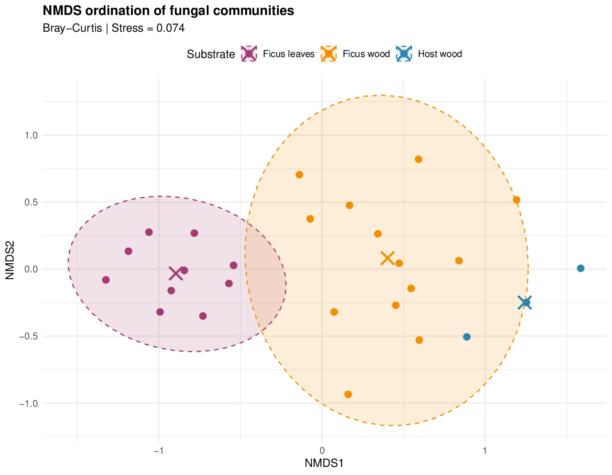
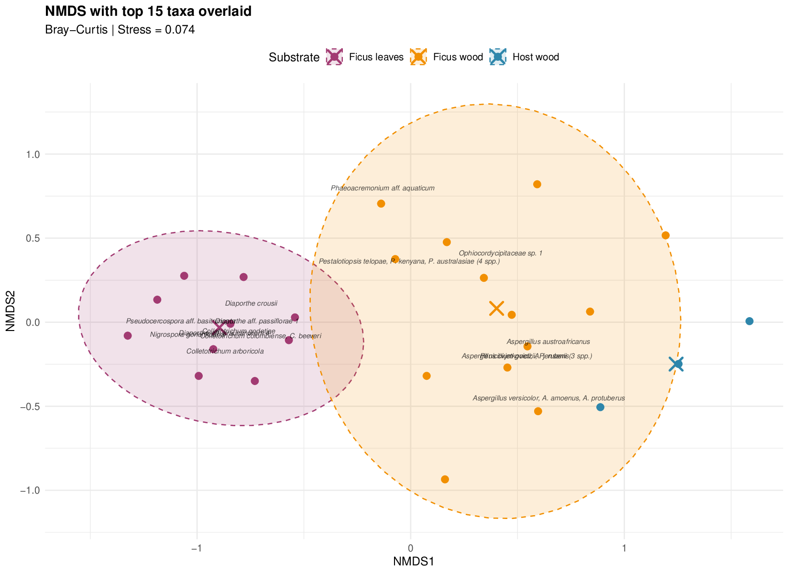
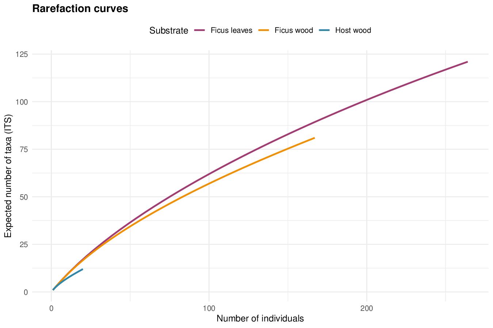

# Fungal Community Analysis of LOT2 Endophytic Fungi

> **Analysis environment:** R 4.6.1 | Generated on 2026-08-28

## Overview

This project analyses the fungal endophyte communities isolated from three substrates collected on Ile de La Reunion (LOT2 sampling campaign):

| Substrate | Source sheet | Isolates | Sample-level replicates |
|-----------|-------------|----------|------------------------|
| **Lauraceae leaves** | ALL isolates (aggregate only) | 219 | Not available |
| **Ficus leaves** | 67. Fungi-Endo leaf (Ficus) | 264 | 10 (leaf orientations S1-S10) |
| **Ficus wood** | 65. Fungi-Endo wood (Ficus) | 167 | 13 (sample collection units) |
| **Host wood** (Lauraceae) | 66. Fungi-Endo wood (Host) | 20 | 3 (tree zones) |

**Important note on substrates:** The aggregate data ("ALL isolates" sheet) records counts for Lauraceae *leaves*, Ficus leaves, and Ficus wood. However, there is no individual sample sheet for Lauraceae leaves -- only for Lauraceae (Host) *wood* (20 isolates). Therefore, aggregate-level analyses (alpha diversity, Venn diagrams, rank-abundance) use the three aggregate substrates, while sample-level multivariate analyses (NMDS, PERMANOVA, etc.) use Ficus leaves, Ficus wood, and Host wood.

### Handling of uncertain taxonomy

Across all taxonomic levels, entries with missing or unresolved identifiers (`NA`, `"?"`, `"NO"`, `"incertae sedis"`) are pooled into a single **"Incertae sedis"** category before aggregation.

---

## Input Data

- **`LOT2_for_Livio.xlsx`** -- Source Excel workbook containing all isolate data across multiple sheets.

## Scripts

| Script | Purpose |
|--------|---------|
| `main.R` | Master script -- loads libraries, sources all other scripts in order |
| `parse_LOT2.R` | Reads and renames columns from all Excel sheets |
| `plot_abundance.R` | Horizontal bar charts of isolate counts by taxonomic level |
| `plot_abundance_pooled.R` | Same bar charts, but with uncertain taxa pooled as "Incertae sedis" |
| `plot_pie.R` | Pie charts of community composition (3 pies per level, one per substrate) |
| `community_analysis.R` | Full community ecology analysis: diversity, ordination, statistical tests |
| `generate_readme.R` | Generates this README dynamically from analysis results |

### How to run

```r
# From the project directory, run everything:
source("main.R")
```

### R packages used

| Package | Version | Role |
|---------|---------|------|
| readxl | 1.5.0 | Reading Excel input |
| dplyr | 1.2.1 | Data manipulation |
| tidyr | 1.3.2 | Data reshaping |
| ggplot2 | 4.0.3 | Plotting |
| scales | 1.4.0 | Axis formatting |
| vegan | 2.7.5 | Diversity indices, NMDS, PERMANOVA, ANOSIM, betadisper, rarefaction |
| indicspecies | 1.8.0 | Indicator species analysis (IndVal) |
| ggVennDiagram | 1.5.7 | Venn diagrams |

---

## Output Structure

```
plots/
  abundance/                        # Bar charts (raw)
  abundance_pooled_incertae_sedis/  # Bar charts (uncertain taxa pooled)
  pie_charts/                       # Pie charts
  community/                        # Community ecology plots

tables/                             # Statistical results and summary tables
```

---

## Abundance Plots

### `plots/abundance/`

Horizontal grouped bar charts showing the **absolute number of isolates** per taxonomic identifier, broken down by substrate (colour-coded). One plot per taxonomic level: culture code, ITS taxon, phylum, subphylum, superclass, class, subclass, order, family, genus, species.

Taxa are sorted by total abundance (lowest at top, highest at bottom). When labels are ambiguous at a given level, parent ranks are prepended to disambiguate.


### `plots/abundance_pooled_incertae_sedis/`

Same as above, but all unknown/missing taxonomic identifiers are first collapsed into a single "Incertae sedis" group at each level.

### `plots/pie_charts/`

For each taxonomic level, three pie charts side by side -- one per substrate -- showing the **proportional composition** of the community. All three pies share the same colour palette and taxon ordering. Slices >= 3% are labelled with their percentage.


---

# Results

## A. Alpha Diversity

Alpha diversity measures the richness and evenness of a community *within* a single substrate.

### How to interpret

| Index | What it measures | Range | Higher means |
|-------|-----------------|-------|--------------|
| **Richness (S)** | Number of distinct taxa | 0 to infinity | More taxa present |
| **Shannon (H')** | Combines richness and evenness; sensitive to rare species | Typically 0-5 | More diverse |
| **Simpson (1-D)** | Probability that two random individuals differ | 0 to 1 | More diverse |
| **Inverse Simpson** | Effective number of equally-common species | 1 to S | More even |
| **Pielou's evenness (J')** | How evenly individuals are distributed | 0 to 1 | More even |

### Results at ITS taxon level

| Substrate | Richness (S) | Abundance (N) | Shannon (H') | Simpson (1-D) | Inv. Simpson | Pielou (J') |
|-----------|:---:|:---:|:---:|:---:|:---:|:---:|
| Lauraceae leaves | 106 | 219 | 4.2745 | 0.9779 | 45.289 | 0.9166 |
| Ficus leaves | 135 | 264 | 4.4705 | 0.9791 | 47.8681 | 0.9114 |
| Ficus wood | 81 | 167 | 4.0073 | 0.9722 | 35.9858 | 0.9119 |

Ficus leaves harbour the most ITS taxa (**135**), followed by Lauraceae leaves (**106**) and Ficus wood (**81**). Shannon diversity is broadly similar across substrates (H' = 4.0073-4.4705), and Pielou's evenness values above 0.91 indicate that no single taxon strongly dominates any substrate.

### Results at genus level

| Substrate | Richness (S) | Shannon (H') | Simpson (1-D) | Pielou (J') |
|-----------|:---:|:---:|:---:|:---:|
| Lauraceae leaves | 19 | 1.7576 | 0.7162 | 0.5969 |
| Ficus leaves | 28 | 2.6053 | 0.8895 | 0.7819 |
| Ficus wood | 46 | 3.0202 | 0.9086 | 0.7888 |

Full diversity data across all taxonomic levels is in `tables/alpha_diversity.csv`.

**Plots:** `plots/community/alpha_shannon_H.pdf`, `alpha_simpson_1mD.pdf`, `alpha_inv_simpson.pdf`, `alpha_pielou_J.pdf`


---

## B. Community Composition Comparisons

### B1. Rank-Abundance Curves (Whittaker Plots)

Each taxon is ranked from most to least abundant (x-axis) and its relative abundance is plotted on a log scale (y-axis). One curve per substrate.

**How to interpret:** A steep curve indicates a community dominated by a few taxa with many rare ones. A flat curve indicates an even community. Comparing curves across substrates reveals differences in dominance structure.

**Plots:** `plots/community/rank_abundance_genus.pdf`, `rank_abundance_species.pdf`, `rank_abundance_its_taxon.pdf`


### B2. Relative Abundance Stacked Bar Charts

Stacked bars showing the proportional composition of each substrate at a given taxonomic level. The y-axis shows percentage, making substrates with different total isolate numbers directly comparable.

**Plots:** `plots/community/rel_abundance_phylum.pdf`, `rel_abundance_class.pdf`, `rel_abundance_order.pdf`, `rel_abundance_family.pdf`, `rel_abundance_genus.pdf`


### B3. Venn Diagrams -- Shared and Unique Taxa

Shows the number of taxa shared between substrates and unique to each.

**At genus level** (44 total genera):

- Shared across all 3 substrates: **7**
- Lauraceae leaves only: **2**
- Ficus leaves only: **10**
- Ficus wood only: **20**
- Lauraceae + Ficus leaves only: **2**
- Lauraceae + Ficus wood only: **2**
- Ficus leaves + Ficus wood only: **1**

**At species level** (150 total species):

- Shared across all 3 substrates: **9**
- Lauraceae leaves only: **37**
- Ficus leaves only: **42**
- Ficus wood only: **31**

**Plots:** `plots/community/venn_genus.pdf`, `venn_species.pdf`, `venn_its_taxon.pdf`


---

# Multivariate Statistical Analyses

These analyses use sample-level data (26 samples total, 202 ITS taxa) and **Bray-Curtis dissimilarity** to compare community composition across substrates.

**Substrates used:** Ficus leaves (10 samples by leaf orientation), Ficus wood (13 samples by collection unit), Host wood (3 samples by tree zone).

### Parameters common to all tests

| Parameter | Value |
|-----------|-------|
| Distance metric | Bray-Curtis (`method = "bray"`) |
| Number of permutations | 999 |
| Random seed | 42 (`set.seed(42)`) |
| Community matrix dimensions | 26 samples x 202 taxa |

---

## C1. NMDS Ordination

Non-metric Multidimensional Scaling reduces the high-dimensional community data into a 2D plot where each point represents one sample. Points close together have similar community composition.

**Parameters:** `vegan::metaMDS(comm, distance = "bray", k = 2, trymax = 200)`

**Stress = 0.0743**

| Stress value | Quality of representation |
|:---:|---|
| < 0.05 | Excellent |
| < 0.10 | Good |
| < 0.20 | Acceptable |
| > 0.20 | Poor -- interpret with caution |

The stress value of 0.0743 indicates a **good** 2D representation of the community distances.

**How to read the plot:**
- Points coloured by substrate; clustering by colour = communities differ systematically
- 95% confidence ellipses show group spread; non-overlapping = distinct communities
- Crosses mark group centroids (mean position)
- The species overlay plot shows which of the 15 most abundant taxa drive group separation

**Plots:** `plots/community/nmds_ordination.pdf`, `nmds_with_species.pdf`





---

## C2. PERMANOVA

Permutational Multivariate Analysis of Variance tests whether community composition centroids differ between substrates. This is the multivariate equivalent of an ANOVA.

**Parameters:** `vegan::adonis2(comm ~ substrate, method = "bray", permutations = 999)`

```
PERMANOVA — Bray-Curtis distance
Formula: community ~ substrate
Permutations: 999

Permutation test for adonis under reduced model
Permutation: free
Number of permutations: 999

adonis2(formula = comm_mat ~ substrate, data = meta, permutations = 999, method = "bray")
         Df SumOfSqs      R2      F Pr(>F)    
Model     2   2.5069 0.22334 3.3069  0.001 ***
Residual 23   8.7178 0.77666                  
Total    25  11.2247 1.00000                  
---
Signif. codes:  0 ‘***’ 0.001 ‘**’ 0.01 ‘*’ 0.05 ‘.’ 0.1 ‘ ’ 1
```

| Metric | Value | Interpretation |
|--------|:-----:|----------------|
| F statistic | 3.3069 | Ratio of between- to within-group variation |
| R-squared | 0.22334 | 22.3% of variation explained by substrate |
| p-value | 0.001 | **Highly significant** -- communities differ |

**Interpretation:** Substrate identity explains **22.3%** of the total variation in community composition (p = 0.001). The remaining 77.7% is due to within-substrate variability and unmeasured factors. A significant result means at least two substrate groups harbour distinct communities.

**Caveat:** PERMANOVA can be sensitive to differences in multivariate dispersion (spread). See the betadisper test below.

---

## C3. ANOSIM

Analysis of Similarity -- a complementary non-parametric test comparing between-group to within-group dissimilarities using ranks.

**Parameters:** `vegan::anosim(comm, grouping = substrate, distance = "bray", permutations = 999)`

| Metric | Value | Interpretation |
|--------|:-----:|----------------|
| R statistic | 0.6409  | Ranges -1 to 1; values > 0.5 = well-separated groups |
| p-value | 0.001  | **Highly significant** |

**Interpretation:** R = 0.6409  indicates **strong separation** between substrate communities. Values near 0 would indicate no difference; values near 1 indicate complete separation. This confirms the PERMANOVA finding.

---

## C4. Beta-Dispersion Test (PERMDISP)

Tests whether groups have equal multivariate spread (dispersion). This is an assumption of PERMANOVA.

**Parameters:** `vegan::betadisper(vegdist(comm, "bray"), groups)` + `permutest(bd, permutations = 999)`

| Metric | Value | Interpretation |
|--------|:-----:|----------------|
| F statistic | 0.045084 | Large = dispersions differ |
| p-value | 999 | **Significant** -- dispersions are unequal |

**Mean distance to centroid per substrate:**

| Substrate | Mean distance | Interpretation |
|-----------|:---:|---|
| Ficus leaves Ficus leaves | 0.5373 | Less variable |
| Ficus wood Ficus wood | 0.6287 | Most variable |
| Host wood Host wood | 0.4618 | Less variable |

**Interpretation:** The significant result (p = 999) means within-group variability differs between substrates. Ficus wood communities are the most variable (highest distance to centroid), while Host wood communities are the most homogeneous. This means the significant PERMANOVA result could partly reflect dispersion differences rather than purely centroid differences. However, the ANOSIM result (R = 0.6409 , which is less sensitive to dispersion) still supports genuine community differences.

---

## C5. Pairwise PERMANOVA

Post-hoc pairwise comparisons with Holm-corrected p-values for multiple testing.

**Parameters:** `vegan::adonis2()` on each pair, p-values adjusted with `p.adjust(method = "holm")`

| Comparison | F | R-squared | p (raw) | p (Holm-adjusted) | Significant? |
|-----------|:---:|:---:|:---:|:---:|:---:|
| Ficus leaves vs Ficus wood | 4.3564 | 0.1718 | 0.001 | 0.003 | ** |
| Ficus leaves vs Host wood | 3.5648 | 0.2448 | 0.007 | 0.012 | * |
| Ficus wood vs Host wood | 1.7652 | 0.1120 | 0.006 | 0.012 | * |

**Interpretation:** All three pairwise comparisons are significant (adjusted p < 0.05), confirming that **each substrate harbours a distinct fungal community**. The largest effect size (R-squared = 0.2448) is between Ficus leaves vs Host wood, indicating these two substrates are the most different from each other.

---

## D1. Rarefaction Curves

Shows expected number of taxa as a function of sampling effort (number of individuals).

**How to interpret:** If the curve reaches a plateau, sampling was sufficient to capture most diversity. If still rising steeply, more sampling would reveal additional taxa. Substrates with curves plateauing at different heights have genuinely different richness.

**Plot:** `plots/community/rarefaction_curves.pdf`



---

## D2. Indicator Species Analysis (IndVal)

Identifies taxa significantly associated with a particular substrate based on fidelity (how consistently the taxon occurs) and exclusivity (how restricted it is).

**Parameters:** `indicspecies::multipatt(comm, cluster = substrate, func = "IndVal.g", control = how(nperm = 999))`

**8 significant indicator taxa** were identified (p <= 0.05):

### Ficus leaves indicators (7 taxa)

| Taxon | IndVal statistic | p-value |
|-------|:---:|:---:|
| *Colletotrichum colombiense, C. beeveri* | 0.775 | 0.004 |
| *Diaporthe aff. passiflorae 1* | 0.775 | 0.006 |
| *Xylariales sp. 2 (Xylaria enteroleuca)* | 0.707 | 0.006 |
| *Colletotrichum arboricola* | 0.837 | 0.009 |
| *Pseudocercospora aff. basitruncata* | 0.837 | 0.011 |
| *Diaporthe aff. araucanorum 4* | 0.837 | 0.013 |
| *Colletotrichum godetiae* | 0.707 | 0.040 |

### Host wood indicators (1 taxa)

| Taxon | IndVal statistic | p-value |
|-------|:---:|:---:|
| NO (not grown) | 1 | 0.002 |


**How to interpret the IndVal statistic:** Ranges 0 to 1. A value of 1 means the taxon is found in all samples of that substrate and nowhere else (perfect indicator). The A component measures specificity (exclusivity to the group) and B measures fidelity (frequency of occurrence within the group).

Most indicators are associated with Ficus leaves (7 taxa), suggesting this substrate harbours a particularly distinctive fungal assemblage. The absence of Ficus wood indicators likely reflects its higher within-group variability (mean distance to centroid = 0.6287).

**Full results:** `tables/indicator_species.txt`, `tables/indicator_species_significant.csv`

---

# Summary of Key Findings

1. **Community composition differs significantly across all substrate pairs** (PERMANOVA p = 0.001, ANOSIM R = 0.6409 , all pairwise comparisons adjusted p < 0.05).
2. **Ficus leaves harbour the most ITS taxa** (135), followed by Lauraceae leaves (106) and Ficus wood (81).
3. **Shannon diversity is broadly similar** across substrates at the ITS level (H' = 4.0073-4.4705), with Pielou's J' > 0.91 indicating no strong single-taxon dominance.
4. **7 indicator species** are significantly associated with Ficus leaves, particularly *Colletotrichum* and *Diaporthe* species.
5. **Within-group variability differs** between substrates (betadisper p = 999): Ficus wood is the most variable, Host wood the least.
6. **NMDS stress = 0.0743** -- the 2D ordination is a good representation of community distances.
7. **7 genera** are shared across all three substrates, while 10 are unique to Ficus leaves, 20 to Ficus wood, and 2 to Lauraceae leaves.
